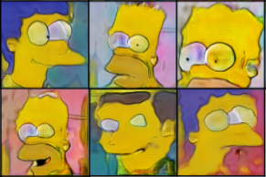

# Études des Generative Adversarial Networks

Ce dépôt a pour objectif de stocker le travail réalisé durant le stage final du Master Intelligence Artificielle et Apprentissage Automatique.
Ce stage de six mois s’est déroulé à l’Institut de Neurosciences de La Timone et a été encadré par Laurent Perrinet, chercheur CNRS à l’université d’Aix-Marseille.
Le principal objectif du stage était la compréhension des Generative Adversarial Networks (GAN) appliquée à la génération d’images.
Les GAN permettent d'apprendre des modèles génératifs pour de large classes de données d'entrées, notamment pour les images, par exemple des visages.

Stage M2 dans le cadre du master https://iaaa.lis-lab.fr/

## Structure du dépôt et méthodes de travail

L'essentiel du code produits durant le stage est en python3. 

Le travail a consister en un grand nombres d'expériences et de teste (notamment de proposition d'articles de recherche).  
Chacune des expériences est ranger dans un dossier nommer W*_nom_de_l_experience/ et les comptes rendu des expériences sont grouper par semaines dans les fichiers W*.md.  
Le fichier Makefile contient un ensemble de commande fréquemment utiliser durant les expériences.  
Le fichier requirements.txt peut être utiliser, dans un environnement virtuel de préférence, pour installer les librairies utiliser pour les expériences.  
```
commande : pip install -r requirements.txt  
```

## Dataset utilisés

  ### Simpsons Faces

Nous avons utiliser un dataset fournie par Konstantinos Tokis qui représente des visages de Simpsons. 

Source : https://www.kaggle.com/kostastokis/simpsons-faces

  ### Fractal Dream Dataset

Pour certaines des expériences que nous souhaitions mener il nous fallait un jeu de données dont chaque image puisse être
associées à un point dans l’espace de manière cohérente. Pour ce faire nous avons décidé de construire un
nouveau jeu de données à partir d’un outil mathématique : les Fractal Dream.
Ce dataset a était mis à disposition sur le site Kaggle, ainsi que les codes
utilisés : https://www.kaggle.com/lgoareguer/fractal-dream-dataset#build.py.

Source : http://datashader.org/topics/strange_attractors.html

## Résultats

Certaine expériences et résultats sont disponibles dans les fichiers Rapport_STAGE_M2_IAAA.pdf et Oral de fin de stage.odp.
Vous pouvez également lire les résultats de chacune des expériences mener dans les compte rendue de chaque semaine (cf. W*.md).  

Images générer avec un DCGAN (cf. W17_DCGAN_MAX):


 
Images générer avec un DCGAN (cf. W17_AE_MAX): 



Interpolation dans l'espace latent (cf. W25_Cycle_SF):


## Ressources

Article présentant une architecture :
  - 
  - 
  -  

Implémentation :
  - 
  - 
  - 
  - 

Entraînement des GANs :
  - 
  - 
  - 
  
Fonction de coût :
  - 
  - 
  - 
  - 

Bases théoriques et difficultés des GANs :
  - 
  - 
  
Interpolation :
  - 
  - 

Spécificités techniques :
  - 
  - 

## Contact

Lucas Goareguer (étudient) : Lucas.Goareguer@etu.univ-amu.fr

Laurent Perrinet (superviseur): Laurent.Perrinet@univ-amu.fr
