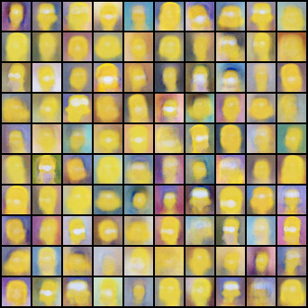
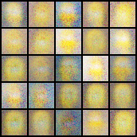
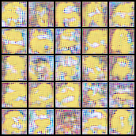

# Résumé de la semaine 1 de stage

## A faire :

- [x]  Mettre à jour l'ordinateur
- [x]  Trouvé un dataset Simpsons
- [x]  Construire un module Dataset torch
- [x]  Trouver un GAN efficace sur le dataset
- [ ] Tunner le GAN jusqu'à avoir un résultats concluant
- [ ] Tester CycleGAN pour transformer des visages humain en Simpsons
- [ ] Prendre en main SDPC
- [ ] Trouver une architecture pour fusionner le GAN et SDPC
- [ ] Evaluer l'intèret de l'architecture
- [ ] Tester BigGan qui promet de bien marcher mais demande beaucoup de ressource : Peut être

## Note d'expériences

###### Test GAN1 DCGAN1 AAE1 en 32*32 lr=0.0002 epochs=200 :

__Résultats__:
  - GAN : résultats brouiller et flou mais forme des visage, couleur jaune et yeux blanc
  - DCGAN : bouillie multi color en fond et jaune au centre
  - AAE : visage flou mais presque reconnaisable (Homer, Marge et Bart), fond presque unis

__Conclusion__ :
  - entrainement fonctionnel
  - epochs trop faible
  - AAE prometteur
  - DCGAN surement besoin de beaucoup plus d'epochs

##### Test GAN2 DCGAN2 AAE2 en 32*32 lr=0.00002 epochs=300 :

__Résultats__ :
  - GAN : aucune convergeance, brouillage jaune uniquement
  - DCGAN : pareil que l'expérience 1
  - AAE : visage plus flou que pour l'expérience 1

__Conclusion__ :
  - l'augmentation des epochs n'a pas compensser la diminution du lr
  - epochs trop faible
  - AAE toujours le plus prometteur

##### Test GAN64 DCGAN64 AAE64 en 64*64 lr=0.00002 epochs=300 :

__Résultats__ :
  - GAN : faible convergeance, forme de visage brouiller
  - DCGAN : pareil que l'expérience 1
  - AAE : la forme des visage n'est aussi bien dessiner que pour les expériences précédentes

__Conclusion__ :
  - les models fonction en 64*64 et cette dimension semble bien pour reconnaître des visages
  - epochs trop faible
  - AAE toujours le plus prometteur

##### Test DCGAN Loss en 32*32 lr=0.00007 epochs=280-266 :
Le loss des AAE inclus une part de comparaison entre l'image générer et l'image réel.
Sur ce principe j'ai ajouter au loss du générateur des DCGAN une comparaison entre l'image générer et l'image réel.
dcganLoss1 : 0.01 * adverserialLoss + 0.99*newLoss
dcganLoss2 : 0.7 * adverserialLoss + 0.3*newLoss

__Résultats__ :
  - dcganLoss1 et dcganLoss2 : Meilleur que DCGAN pour un nombre d'epochs comparrable
  - Le dcganLoss1 semble commencer a dessiner des contours
  - dcganLoss1 > dcganLoss2

__Conclusion__ :
  - L'ajout de ce nouveau loss améliore la qualité des images produites
  - Il faudrait tester avec plus epochs et 0.999*newLoss (comme pour le aae)

##### Test AAE3 en 32*32 lr=0.00007 epochs=430 :

__Résultats__ :
  - AAE1 > AAE3 > AAE2
   - AAE3 : La forme des visage n'est pas très bien dessiner

__Conclusion__ :
  - epochs trop faible
  - AAE3 moins bon
  - lr trop faible pour le nombre d'epochs

Next exp:
* dcganLoss3 : 0.001 * adverserialLoss + 0.999*newLoss epochs = 600 lr = 0.00007
* dcganLoss4 : 0.1 * adverserialLoss + 0.9*newLoss epochs = 600 lr = 0.00007
* aae4 : lr=0.00012 epochs=1320
* aaeLoss1 : lr=0.00012 epochs=1000  0.1*adverserialLoss + 0.9*newLoss
