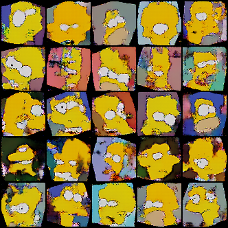
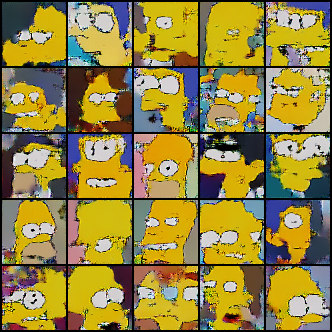
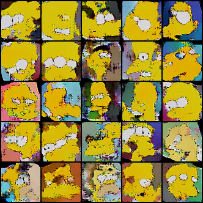

# Résumé de la semaine 10 de stage

## A faire :

- [x]  Mettre à jour l'ordinateur
- [x]  Trouvé un dataset Simpsons
- [x]  Construire un module Dataset torch
- [x]  Nettoyer le dataset Dataset (cf. W10_dataset_dcgan)
- [x]  Trouver un GAN efficace sur le dataset
- [ ] Tunner le GAN jusqu'à avoir un résultats concluant
- [ ] Tester CycleGAN pour transformer des visages humain en Simpsons
- [ ] Prendre en main SDPC
- [ ] Trouver une architecture pour fusionner le GAN et SDPC
- [ ] Evaluer l'intèret de l'architecture
- [ ] Tester BigGan qui promet de bien marcher mais demande beaucoup de ressource : Peut être
- [x] from skimage.color import rgb2hsv
- [x] https://pytorch.org/docs/stable/torchvision/transforms.html#torchvision.transforms.RandomAffine

## Mise à jour des codes communs

Importante modification de la classe FastSimpsonsDataset :
Les images sont toutes chargées avant le train mais elle sont traitée (Normalization,..) à chaque appelle de __getitem__.
La fonction load_data de utils.py à était modifier pour tenir compte de ces changements.

## Note d'expériences

#### Test Affine en 64x64 batchsize=64 epochs=200 
Utilisation de (RandomAffine)[https://pytorch.org/docs/stable/torchvision/transforms.html#torchvision.transforms.RandomAffine] pour augmenter le dataset.

Rotate : Ajout d'une rotation aléatoire entre 
Scale : Ajout d'un zoom aléatoire entre 
Both : Ajout d'une rotation et d'un zoom aléatoire entre 

Hypothèse 1 : Les images du dataset contiennent beaucoup de détails dans le fonds, une rotation pourrait permettre de "estomper".
Hypothèse 2 : Certaine images contiennent des visage très petit par rapport au décors, cela pousse le modèle à apprendre les fonds. Un zoom aléatoire pourra "estomper" cet effet. 

Code copié de W8_HRF_dcgan, comparer avec.

__Résultats__ :
  - Rotate : Des coins noirs apparaisse sur les images dû aux rotations. Scores et losses (lossG surtout) augmente un peut moins rapidement. On constate un pics vers 135e mais pas de collapse. Les images sont moins nette et moins bien former qu'avec juste HRF.
		Time=1h10m
  - Scale : Les scores sont quasi identique à ceux de HRF.
		Time=1h5m
  - Both : Le lossG augmente moins vite et va moins haut. Les scores sont plus proche et s'éloignent moins vite (D(x)=0.8 à 200epochs contre 0.9 pour HRF seul). Les images sont moins bonne et contiennent plus d'artefacts. L'effet des coins noirs de la rotation est moins présent, dû au scale.
		Time=1h10m
		
__Conclusion__ :
  - Rotate :
    - On constate certaine image pour lequel les deux rotation possible (gauche et droite) on était générer. G n'a pas appris que les rotations (et donc les coins noirs) ne peuvent être que d'un coté et pas des deux en même temps. De manière plus général G n'a pas compris la rotation (certain coins noirs mais pas les 4).
    - L'apprentissage est surement ralentie par les rotations : images moins belle et losses moins rapide. Le modèle à besoin de plus de temps.
  - Scale :
    - Les images semble plus 
  - Both :
    - 
    

  
  
#### Test Dataset en 64x64 batchsize=64 epochs=200 
Le datatset contient des images qui ne sont pas de visage, des visages très mal cadrer et bien d'autres soucis. Travailler à améliorer le dataset est une voie prometteuse. 

Light : Retrait des images les plus lourdes car elles contiennent à priori plus de détails. (les 1000 plus lourdes images : 10% des images pour 14% du poids total)
Clear : Retrait des images contenant du texte du générique, pas de visage ou des visage beaucoup trop mal cadrer (168 images de moins).

Hypothèse 1 : Les images remplie de tout petits détails (dans le fonds notamment) n'ont pas d'intérêt pour la génération de visage voir même la détériore.
Hypothèse 2 : Le retrait des images "polluer" (Texte du générique, pas de visage ou visage beaucoup trop mal cadrer) va améliorer les performances du systèmes.

Code copié de W8_current_dcgan puis ajout de HRF et valid smooth.
Comparable avec W8_HRF_dcgan (notamment (dataloader_modif))

__Résultats__ :
  - Light : Les courbes sont beaucoup moins bruités. Les images contiennent moins d'artefacts et plus de visages sont mieux former (plus de visage avec deux yeux).
		Time=1h
  - Clear : Courbes visuellement identique à HRF. Les visages sont plus nombreux à être mieux former et on constate plus souvent deux yeux correcte.
		Time=1h5m

__Conclusion__ :
  - Hypothèse 1: Les images les plus lourde complexifie l'apprentissage et leurs retrait permet des images avec moins d'artefact et plus de visage mieux former
  - Les résultast de Clear et HRF sont très proches, Clear est baser sur W8_current_dcgan donc la validité de la version est comfirmé par cette expérience.
  - Les images de Clear et Light sont meilleur que celles de HRF. Difficile de dire si l'une est meilleur que l'autre.
  - Les deux idées appliquées ici sont concluante, elles pourrait être utiliser ensemble et devrait normalement être compatible.    

  
#### Test ResetD en 64x64 batchsize=64 epochs=200 
Quand D(x).mean() et D(G(z)).mean() atteigne un seuil (0.7 et 0.2), les poids de D sont reset, l'entraînement de G est suspendue jusqu'à un autre seuil (0.6 et 0.3), l'entraînement de G est repris et ainsi de suite. 

Hypothèse : Le modèle ne va pas stagner car D est toujours appris sur un meilleurs G et G est confronter à un D qui fait des erreurs.

copie de W10_affine_dcgan/Clear
Comparable avec W8_HRF_dcgan (notamment (dataloader_modif))

__Résultats__ :
  - DCGAN : 
    Time=2h (Pas seul)
		
__Conclusion__ :
  - ERREUR d'implémentation
  
#### Test MNISTtreshold en 64x64 batchsize=64 epochs=200 
Teste simplifier du système de seuil de W7_128treshold_dcgan pour explorer de nouveau le treshold.

__Résultats__ :
  - DCGAN seuil=0.25 : D et G deviennent très bon très rapidement. On ne constate rien de particuler sur les courbes.
    Time=3h10m (Pas seul)
		
__Conclusion__ :
  - Difficiles de conclure quoi que ce soit avec cette expérience étant donnée que le modèle est sur dimensionner par rapport à MNIST il est normale qu'il réussissent à apprendre.
