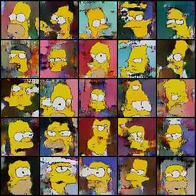
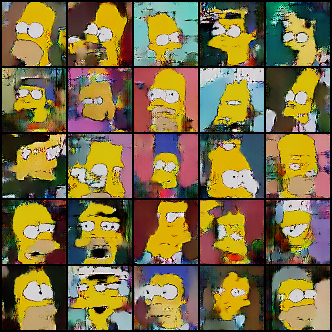

# Résumé de la semaine 11 de stage

## A faire :

- [x]  Mettre à jour l'ordinateur
- [x]  Trouvé un dataset Simpsons
- [x]  Construire un module Dataset torch
- [x]  Nettoyer le dataset Dataset (cf. W10_dataset_dcgan)
- [x]  Trouver un GAN efficace sur le dataset
- [ ] Tunner le GAN jusqu'à avoir un résultats concluant
- [ ] Tester CycleGAN pour transformer des visages humain en Simpsons
- [ ] Prendre en main SDPC
- [ ] Trouver une architecture pour fusionner le GAN et SDPC
- [ ] Evaluer l'intèret de l'architecture
- [ ] Tester BigGan qui promet de bien marcher mais demande beaucoup de ressource : Peut être
- [x] from skimage.color import rgb2hsv
- [x] https://pytorch.org/docs/stable/torchvision/transforms.html#torchvision.transforms.RandomAffine
- [ ] Apprendre à utliser Tensorboard
- [x] Ajouter des affichages de résultats plus complets (std, coefficient de variation,..)

## Mise à jour des codes communs

Ajout du fichier plot.py contenant les fonctions relatives à l'affichage des courbes.
Les fonctions ne sont donc plus dans utils.py

## Note d'expériences
  
#### Test InitAE en 64x64 batchsize=64 epochs=200 
Utilisation d'un encoder E pour initialiser G comme un Auto-Encoder.

Init : Initialisation avant l'apprentissage (20 epoch)

Hypothèse 1 : Les poids de G seront initialiser de sorte qu'ils produiront dés le départ des images du dataset à partir de bruits.

__Résultats__ :
  - Init : On constate un pics à la fin du scores et du losses qui est un collapse. L'apprentissage est semblable à W8_HRF_dcgan si ce n'est que les images sont moins bonnes.
    Time = 2h5m (Pas seul)
		
__Conclusion__ :
  - Init : Aucun gain observer.

#### Test ResetD en 64x64 batchsize=64 epochs=400 
Quand D(x).mean() et D(G(z)).mean() atteigne un seuil (0.7 et 0.2), les poids de D sont reset, l'entraînement de G est suspendue jusqu'à un autre seuil (0.6 et 0.3), l'entraînement de G est repris et ainsi de suite. 

Hypothèse : Le modèle ne va pas stagner car D est toujours appris sur un meilleurs G et G est confronter à un D qui fait des erreurs.

copie de W10_affine_dcgan/Clear
Comparable avec W8_HRF_dcgan (notamment (dataloader_modif))

__Résultats__ :
  - DCGAN 200e 64x64: Les courbes montrent bien les points où les modèles sont charger. On constate que après chaque chargement D à de grande difficultés à classer les images et il à encore plus de difficultés après le seconds chargement. Ensuite D apprent de nouveau mais avec plus de lenteur semblent-il. Les images varies très peut durant l'apprentissage mais elle semble s'améliorer légèrement.
    Time=2h (Pas seul)
  - DCGAN 400eBUG: Ici un bug sauvegarder et charger à chaque epochs.
    Time=2h (Pas seul)
  - DCGAN 400e 64x64: Les images s’améliore tout le long de l'entraînement (cf. 200_400e.png et 400_400e.png). D met de moins en moins de temps à retrouver sont états précédents (niveau score notamment).
    Time=2h30m
  - DCGAN 400e 64x64 bis: Apprentissage en continue mais très lent. Ré-apprentissage de plus en plus lent.  
    Time=2h50m
  - DCGAN 150e 64x64 zoom (gt-0 dcgan2): Un zoom de 400e 64x64 bis pour comprendre des reset
    Time=55m
  - DCGAN 1000 64x64 (gt-0 dcgan3): Un prolongement de 400e 64x64 bis pour évaluer la stabilité
    Time=
		
__Conclusion__ :
  - ERREUR d'implémentation, relancer : Corriger
  - Je ne comprend pas pourquoi les images générer par G sont toujours différente alors qu'il devrait y avoir une phase durant la quelle G ne bouge plus et donc génère toujours les même images.
  - 200e  64x64:
    - Les résultats sur 200 epochs ne montre que deux chargement.
    - On peut dire que les courbes obtenues sont assez proches de celles qu'on pouvait attendre.
    - Si on suppose que le comportement des modèles est continue avec plus d'epochs on peut dire que la phase de réapprentissage est de plus en plus longue. Cela indique que G est devenue meilleur et donc que D prend plus de temps pour différencier le vrai du faux.
    - Hypothèse : Ces premiers résultats semble montrer que G ne stagne pas puisque D met de plus en plus de temps à le confondre. 
  - 400e 64x64 :
    - Ici l'entraînement de G continue tout le long.
    - On ne constate plus que D met de plus en plus de temps à ré-apprendre mais cela ne veut pas forcement dire que G ne s'améliore pas.
    - Les images semblent un peut meilleurs à la fin (par rapport au milieu) de l'apprentissage. Reste à savoir si l'on aurait pas eu le même résultats avec un apprentissage standard.
    - Refaire cette expérience en bloquant l'entraînement de G régulièrement 
  - 400e 64x64 bis:
    - Ici l'entraînement de G est régulièrement bloquer : Échecs de la manœuvre BUG.
    - 150e 64x64 zoom pour mieux comprendre pourquoi G ne ce met pas en pause

#### Test 128treshold en 128x128 batchsize=64 epochs=200 
Nouvelle version du treshold
D(x) = treshold + D(x) * (1-2*treshold)
D(G(z)) = treshold + D(G(z)) * (1-2*treshold)
valid = 1-treshold
Idée : Empêcher les réponses de D trop catégorique (jamais 0 ou 1).

__Résultats__ :
  - DCGAN seuil=0.05 : Les courbes et les images montre que seul D apprend.
    Time=2h30m (Pas seul)
  - DCGAN seuil=0.10 :
    Time=
  - DCGAN seuil=0.15 :
    Time=
		
__Conclusion__ :
  - Il va falloir mieux comprendre la nature des réponse de D(.) (cf. W11_Curve_dcgan)

#### Test Curve en 32x32 batchsize=64 epochs=200 
Ajout de nouvelles courbes pour mieux comprendre la répartition des réponse de D.

Courbes ajouter :
  - Std(D(.)) : Moyenne des écart type des réponse de D(.) sur chaque epochs.
  - CV(D(.)) : Moyenne des coefficient de variation des réponse de D(.) sur chaque epochs.
  - Intervalle min/max : Colorisation de l'intervalle entre les courbes min(D(.)) et max(D(.)) sur chaque epochs.

__Résultats__ :
  - DCGAN : On constate que les réponse de D ne sont pas trop cétégorique (cf. min_max.png) dans un premier temps (< 50epochs)
    Time=55m
		
__Conclusion__ :
  - Bug dans l'initialisation des min. Corriger 
