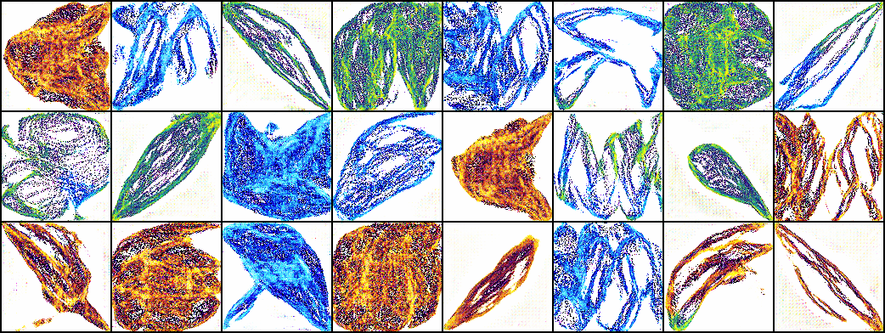

# Résumé de la semaine 15 de stage

## A faire :

- [x]  Mettre à jour l'ordinateur
- [x]  Trouvé un dataset Simpsons
- [x]  Construire un module Dataset torch
- [x]  Nettoyer le dataset Dataset (cf. W10_dataset_dcgan)
- [x]  Trouver un GAN efficace sur le dataset
- [ ] Tunner le GAN jusqu'à avoir un résultats concluant
- [ ] Tester CycleGAN pour transformer des visages humain en Simpsons
- [ ] Prendre en main SDPC
- [ ] Trouver une architecture pour fusionner le GAN et SDPC
- [ ] Evaluer l'intèret de l'architecture
- [ ] Tester BigGan qui promet de bien marcher mais demande beaucoup de ressource : Peut être
- [x] from skimage.color import rgb2hsv
- [x] https://pytorch.org/docs/stable/torchvision/transforms.html#torchvision.transforms.RandomAffine
- [x] Apprendre à utliser Tensorboard
- [x] Ajout d'un module de scan des paramètre compatible avec tensorboard (cf. current pour plus de détails)
- [x] Ajouter des affichages de résultats plus complets (std, coefficient de variation,..)
- [x] Création d'un dataset baser sur un espace latent connue [cf. ref](http://datashader.org/topics/strange_attractors.html)

## Mise à jour des codes communs

 - Construction du dataset Fractal Dream Dataset

###Utilisation de tensorboard :

1 - Dans le code [Tutoriel](https://www.tensorflow.org/guide/summaries_and_tensorboard) [Doc](https://pytorch.org/docs/stable/tensorboard.html)
2 - Les codes compatibles sauvegardes les données dans un dossier, par défault ./runs/.
3 - Puis la commande : tensorboard --logdir=runs, permet de lancer un serveur pour visualiser ces données durant l'entraînement sur le port 6006.
4 - Connexion sur le port 6006 du GPU depuis le port 16006 de l'ordinateur : ssh -p8012 -L16006:localhost:6006 g14006889@gt-0.luminy.univ-amu.fr
5 - Ouverture d'un navigateur à l'adresse : http://localhost:16006

## Note d'expériences

#### Test AE_dcgan_small en 128x128 epochs=200 eps=0.05
Utilisation de tensorboard pour l'Adverserial Auto-Encoder.
Architecture alléger.

__Résultats__ :
  - dcgan : On constate un apprentissage plutôt habituel. Les images sont relativement bonne et on constate principalement des formes imprécises (yeux, visage).
    Time= 
		
__Conclusion__ :
  - La Batch Normalization bloque complètement l'entraînement pendant plusieurs (150) epochs. J'ai relancer avec eps=0.05.  
  - Le nombre réduit de filtres semble simplifier les images produites, il faudra comparer avec AE_dcgan_large
  
#### Test AE_dcgan_large en 128x128 epochs=200 eps=0.05
Utilisation de tensorboard pour l'Adverserial Auto-Encoder.
Architecture booster.

__Résultats__ :
  - dcgan : On constate un colaspe après 90 epochs. Avant cela on constate des formes de visage plutôt très convaincante. Il n'y a pas d'artefact notable.
    Time= 19h45m
		
__Conclusion__ :
  - Il faudrait poursuivre cette expérience de sorte d'éviter le collapse pour voir si la capacité du modèle améliore la qualité des images. 

#### Test FDD en 128x128 epochs=200 eps=0.1
Premier test du Fractal Dream Dataset et scan de paramètres pour régler le modèle.
Objectif : Obtenir un GAN qui marche sur FDD.
Scan des paramètre :
  - lrG [0.0005, 0.001, 0.0001] 
  - lrD [0.00005, 0.0001, 0.00001]
  - eps [0.5, 0.0]
cf. scan_params.py

__Résultats__ :
  - board gt-0 : 
  - lrG : Les deux valeurs les plus basses ne sont pas assez haute pour que l'apprentissage ce déroule correctement
  - lrD : 
    - On constate que lrD=0.00001 ne fonctionne pas : les images sont des pâté informe et les courbes de losses stagnent. On peut également dire que l'ont ce trouve dans un équilibre qui est dû au faite que D n'apprend rien, donc G n'ont plus.
    - Avec eps=0.5 on constate que lrD=0.00005 collapse avant de revenir à la normale (sauf avec lrG=0.0001).
  - eps : Une valeurs de 0.5 accélère et stabilise l'apprentissage. Le lossG augmente moins vite avec eps=0.5.
    Time= 2h5m (x18)
		
__Conclusion__ :
  - Meilleur valeur tester :
    - lrD : 0.0001
    - lrG : 0.001
    - eps : 0.5
  - On constate des artefact autour des figures avec les meilleurs paramètres. Sans doute dû à du sur-apprentissage.

