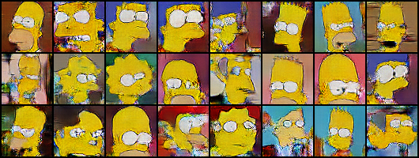

# Résumé de la semaine 16 de stage

## A faire :

- [x]  Mettre à jour l'ordinateur
- [x]  Trouvé un dataset Simpsons
- [x]  Construire un module Dataset torch
- [x]  Nettoyer le dataset Dataset (cf. W10_dataset_dcgan)
- [x]  Trouver un GAN efficace sur le dataset
- [ ] Tunner le GAN jusqu'à avoir un résultats concluant
- [ ] Tester CycleGAN pour transformer des visages humain en Simpsons
- [ ] Prendre en main SDPC
- [ ] Trouver une architecture pour fusionner le GAN et SDPC
- [ ] Evaluer l'intèret de l'architecture
- [ ] Tester BigGan qui promet de bien marcher mais demande beaucoup de ressource : Peut être
- [x] from skimage.color import rgb2hsv
- [x] https://pytorch.org/docs/stable/torchvision/transforms.html#torchvision.transforms.RandomAffine
- [x] Apprendre à utliser Tensorboard
- [x] Ajout d'un module de scan des paramètre compatible avec tensorboard (cf. current pour plus de détails)
- [x] Ajouter des affichages de résultats plus complets (std, coefficient de variation,..)
- [x] Création d'un dataset baser sur un espace latent connue [cf. ref](http://datashader.org/topics/strange_attractors.html)

## Mise à jour des codes communs

###Utilisation de tensorboard :

1 - Dans le code [Tutoriel](https://www.tensorflow.org/guide/summaries_and_tensorboard) [Doc](https://pytorch.org/docs/stable/tensorboard.html)
2 - Les codes compatibles sauvegardes les données dans un dossier, par défault ./runs/.
3 - Puis la commande : tensorboard --logdir=runs, permet de lancer un serveur pour visualiser ces données durant l'entraînement sur le port 6006.
4 - Connexion sur le port 6006 du GPU depuis le port 16006 de l'ordinateur : ssh -p8012 -L16006:localhost:6006 g14006889@gt-0.luminy.univ-amu.fr
5 - Ouverture d'un navigateur à l'adresse : http://localhost:16006

## Note d'expériences

#### Test AE_dcgan_large en 32x32 epochs=200
Utilisation de tensorboard pour l'Adverserial Auto-Encoder.
Paramétrages de l'architecture booster.
Objectif : Trouver des paramètres efficace pour ce modèle en 32x32 pour ensuite les tester en 128x128.
Scan des paramètre :
  - eps
cf. scan_params.py
  - b1
cf. scan_params2.py
  - lrD
  - lrG
  - lrE
cf. scan_params3.py : Comparer avec eps=0 et comparer le facteur entre lrG et lrD.
  - lrelu
cf. scan_params4.py 
  - lrG
  - lrE
cf. scan_params5.py 

__Résultats__ :
  - dcgan : 
    - La Batch Normalization n'as pas un effet bénéfique sur ce modèle. 
    - Un b1=0.9 fonctionne mieux que des valeurs plus basses.
    - lr scan 4 : 
      - Les valeurs lrG0.001lrE0.001lrD0.0001 rende le modèle instable car elle sont trop élever.
      - Un facteur 10 entre lrD et lrG/lrE est trop élever. Les meilleurs résultats on était obtenus avec un facteur x3.
      - La configuration lrG0.0001lrE0.0001lrD1e05 montrent des courbes encourageante mais des images moins bonne qu'avec un facteur x3.
    - lr scan 5 : L'idée était de savoir si le lrE et le lrG devait être les même ou non et la réponse semble être oui. 
    - leaky relu : 
      - Une valeur de 1 empêche tout entraînement.
      - Un valeur élever (0.5) semble ralentir l'entraînement, ce qui au vue des courbes pourrait être une bonne chose.
      - Les valeurs basses (0.1,0.01,0.02) sont difficile à classer mais donne de bon résultats. 
    Time= 3h25m
		
__Conclusion__ :
  - Meilleur valeur tester :
    - b1 : 0.9
    - eps : 0.0
    - lrD : 0.00005
    - lrG : 0.00015
    - lrE : 0.00015
    - lrelu : 0.01
  - lr : Le facteur entre les différents lr semble avoir était trop élever (x10). Il faut utiliser des lr plus proches.
    - Un facteur entre les lr de x3 ou x4 avec un lrD plus bas que les Meilleur valeurs trouvée pourrait être efficace.
	  - Après le teste de lrG0.0001lrE0.0001lrD0.000025 (x4 et moins grand que les meilleurs valeurs trouver) le teste n'a pas était concluant.
  - LrE et LrG doivent avoir la même valeurs.
  - Leaky ReLU : Les valeurs les plus basses donne les meilleurs résultats.
    - Les valeurs hautes semble ralentir l'entraînement, il faudrait tester 0.5 sur plus d'epochs. 
    - Les valeurs basses ce rapproche d'un ReLU standard, il faudrait tester une valeur très proche de 0.
      - Une valeur trop haute empêche l'entraînement mais une valeurs suffisamment base (0.01 ou 0.02) présente des bénéfice au début de l'entraînement.
  
#### Test AE_64_large en 64x64 epochs=200
Utilisation de tensorboard pour l'Adverserial Auto-Encoder.
Paramétrages de l'architecture booster.
Objectif : Vérifier que les paramètres trouver en 32x32 fonctionne avec une taille plus élever.
Paramètre :
  - lrD : 0.00005
  - lrG : 0.00015
  - lrE : 0.00015
  - eps : 0.0
  - b1 : 0.9

__Résultats__ :
  - dcgan : On constate des visages bien dessiner mal grès de nombreux défaut dans les images (flou, déformation,..)
    Time= 5h50m
		
__Conclusion__ :
  - Il semble que les paramètres trouver en 32x32 soit fonction également en 64x64. On à gagner du temps ;)
  - Les images avec les AAE présente toujours un flou important qui semblent s'estomper sur certain de ces visages.

#### Test dcgan_boost en 64x64 epochs=200
Utilisation de nombreux filtres et de kernels de taille 9 pour un DCGAN.
Paramétrages de l'architecture booster.
Objectif : Déterminer si une architecture booster permet au modèle DCGAN d'avoir de meilleur résultats.
Scan des paramètre :
  - lrG 
cf. scan_params.py
  - lrelu
  - eps
  - b1
cf. scan_params2.py (board2 gt-2)

__Résultats__ :
  - dcgan : 
    - Les variations du LrG on peut d'effet sur les résultats. Les images sont plutôt bonnes. On peut observer que comparer a AE_64_large les résultats ne présente pas de flou mais un bruit moins régulier (artefacts).
    - lrelu : Le niveau de lrelu à peut, voir pas, d'effet sur les résultats.
    - b1 : Une valeur de 0.5 donne de bons résultats dès le début de l'apprentissage alors qu'avec 0.9 il faut attendre au moins 50 epochs. Les courbes sont également plus proches de ce qu'on l'ont attend avec b1=0.5.
    - eps : Le niveau de batchNormalisation semble avoir peut d'impact sur les images. Néanmoins une valeur élever (0.5) fonctionne mieux qu'une valeurs basses (0.05).
    Time= 3h20m
		
__Conclusion__ :
  - Cette expérience montrent que l'augmentation de la taille des kernels et du nombre de filtres permettent une amélioration importante des résultats.
  - On peut également comparer ces résultats avec ceux obtenus dans AE_64_large qui utiliser un AAE :
    - On remarque que le flou caractéristique des AAE (pour nous), n'est pas présent ici mais à la place on a des artefacts irréguliers. 
   - Meilleur valeur tester :
    - lrG : 0.00025
    - b1 : 0.5
    - eps : 0.5
    - lrelu : 0.000001
    

  
#### Test FDD_cgan en 64x64 epochs=200
Mise en pratique du Conditionnal DCGAN sur le datatset FDD
Objectif : Déterminer si le CGAN permet de meilleur résultats 

__Résultats__ :
  - cgan : 
    Time= 
		
__Conclusion__ :
  - :
