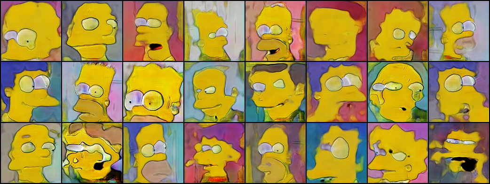
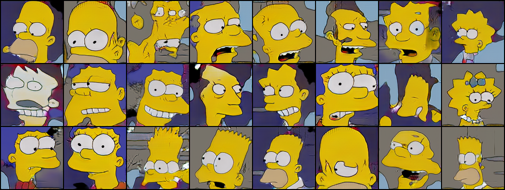

# Résumé de la semaine 17 de stage

## A faire :

- [x]  Mettre à jour l'ordinateur
- [x]  Trouvé un dataset Simpsons
- [x]  Construire un module Dataset torch
- [x]  Nettoyer le dataset Dataset (cf. W10_dataset_dcgan)
- [x]  Trouver un GAN efficace sur le dataset
- [ ] Tunner le GAN jusqu'à avoir un résultats concluant
- [ ] Tester CycleGAN pour transformer des visages humain en Simpsons
- [ ] Prendre en main SDPC
- [ ] Trouver une architecture pour fusionner le GAN et SDPC
- [ ] Evaluer l'intèret de l'architecture
- [ ] Tester BigGan qui promet de bien marcher mais demande beaucoup de ressource : Peut être
- [x] from skimage.color import rgb2hsv
- [x] https://pytorch.org/docs/stable/torchvision/transforms.html#torchvision.transforms.RandomAffine
- [x] Apprendre à utliser Tensorboard
- [x] Ajout d'un module de scan des paramètre compatible avec tensorboard (cf. current pour plus de détails)
- [x] Ajouter des affichages de résultats plus complets (std, coefficient de variation,..)
- [x] Création d'un dataset baser sur un espace latent connue [cf. ref](http://datashader.org/topics/strange_attractors.html)

## Mise à jour des codes communs

###Utilisation de tensorboard :

1 - Dans le code [Tutoriel](https://www.tensorflow.org/guide/summaries_and_tensorboard) [Doc](https://pytorch.org/docs/stable/tensorboard.html)
2 - Les codes compatibles sauvegardes les données dans un dossier, par défault ./runs/.
3 - Puis la commande : tensorboard --logdir=runs, permet de lancer un serveur pour visualiser ces données durant l'entraînement sur le port 6006.
4 - Connexion sur le port 6006 du GPU depuis le port 16006 de l'ordinateur : ssh -p8012 -L16006:localhost:6006 g14006889@gt-0.luminy.univ-amu.fr
5 - Ouverture d'un navigateur à l'adresse : http://localhost:16006

## Note d'expériences

#### Test AE_histE_dcgan en 64x64 epochs=200
Observation des réponse de E.
Utilisation des dernier paramètres tester jusqu'ici.
Objectif : Déterminer si l'encoder respecte une distribution gaussienne dans ses réponse. 

__Résultats__ :
  - dcgan : On peut voir avec les histogramme des réponse de E qu'il respecte une distribution gaussienne entre -1 et 1.
    Time= 
		
__Conclusion__ :
  - L'hypothèse est comfirmer !

#### Test AE_dcgan_scan en 32x32 epochs=200
Scan de AAE pour la semaine 17.
  - latent_dim
cf. scan_params.py 

__Résultats__ :
  - aae : 
    - latent_dim : Les courbes ainsi que les images sont très semblable.
    Time= 3h20m
		
__Conclusion__ :
- latent_dim : La taille de l'espace latent ne semble pas avoir d'impact important sur la qualité des images.
  - Meilleur valeur tester :
    - latent_dim : 24 (surement peut d'importance)

#### Test dcgan_scan en 64x64 epochs=200
Scan de DCGAN pour la semaine 17.
  - latent_dim
cf. scan_params.py 

__Résultats__ :
  - dcgan : 
    - latent_dim : Les courbes ainsi que les images sont très semblable. On constate un collapse à la fin  de chaque runs. 
    Time= 3h25m

__Conclusion__ :
  - latent_dim : La taille de l'espace latent ne semble pas avoir d'impact important sur la qualité des images.
  - Meilleur valeur tester :
    - latent_dim : peut d'importance
    
#### Test FDD_dcgan en 128x128 epochs=200
Paramétrage d'un DCGAN pour FDD
Scan paramètres :
  - lrD
  - lrG
cf. scan_params.py 
  - eps
  - b1
  - lrelu
cf. scan_params2.py 

__Résultats__ :
  - dcgan :
    - Un lr élever fonctionne bien mieux qu'avec les simpsons.
    - B1 doit avoir une valeur de 0.5 et pas de 0.9
    - Un eps trop bas complique le début de l'apprentissage et à laisse des artefacts autour des figures à la fin (200 epochs). 
    - L'impacte du lrelu n'est pas significatif
    Time= 50m
		
__Conclusion__ :
  - Meilleur valeur tester :
    - lrG : 0.001
    - lrD : 0.0001
    - b1 : 0.5
    - eps : 0.5
    - lrelu : 0.000001

#### Test AE_MAX en 128x128 epochs=200
Test grande taille et avec les tous dernier paramètres disponible.

Paramètres : 
- batch_size=16
- lrD=0.00004
- lrG=0.0004
- lrE=0.0004
- eps=0.01
- b1=0.9
- b2=0.999
- lrelu=0.1

__Résultats__ :
  - aae : On obtient les meilleurs images jusque là.
    Time= 1j7h10m
		
__Conclusion__ :
  - :

    
#### Test dcgan_MAX en 128x128 epochs=300
Test grande taille et avec les tous dernier paramètres disponible.

Paramètres : 
- batch_size=16
- lrD=0.00005
- lrG=0.00025
- eps=0.5
- b1=0.5
- b2=0.999
- lrelu=0.000001

__Résultats__ :
  - dcgan : On obtient les meilleurs images jusque là.
    Time= 18h
		
__Conclusion__ :
  - :
  

