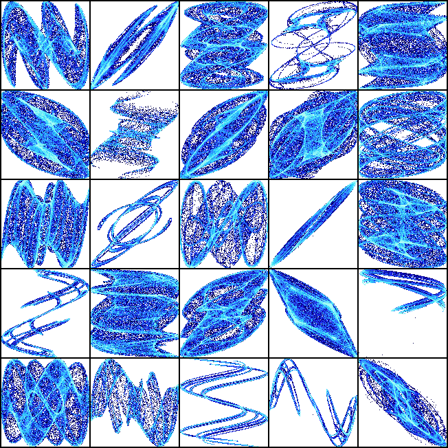
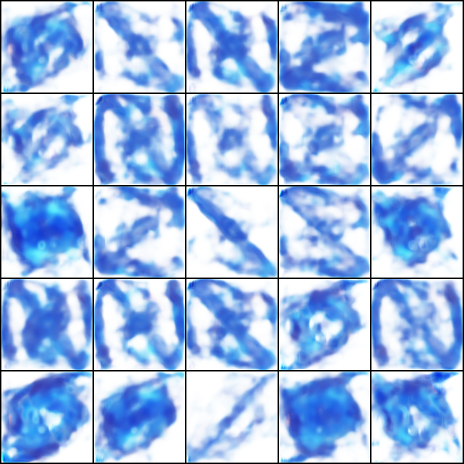
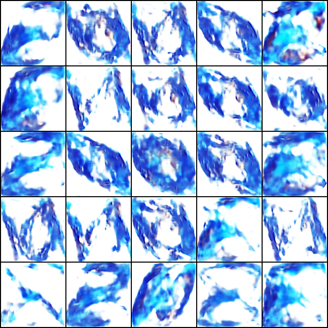
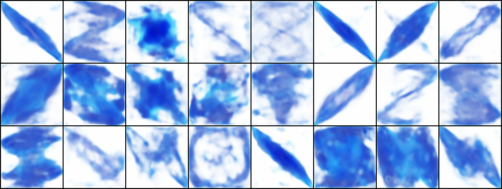
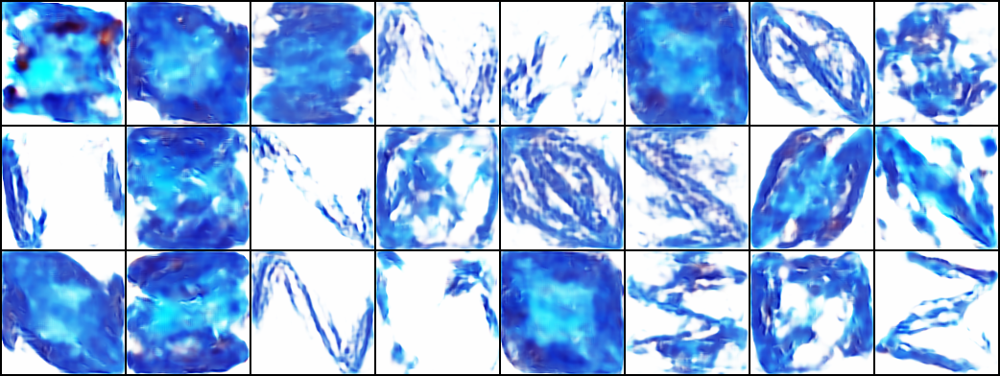

# Résumé de la semaine 19 de stage

## A faire :

- [x]  Mettre à jour l'ordinateur
- [x]  Trouvé un dataset Simpsons
- [x]  Construire un module Dataset torch
- [x]  Nettoyer le dataset Dataset (cf. W10_dataset_dcgan)
- [x]  Trouver un GAN efficace sur le dataset
- [x] Tunner le GAN jusqu'à avoir un résultats concluant
- [ ] Tester CycleGAN pour transformer des visages humain en Simpsons
- [ ] Prendre en main SDPC
- [ ] Trouver une architecture pour fusionner le GAN et SDPC
- [ ] Evaluer l'intèret de l'architecture
- [ ] Tester BigGan qui promet de bien marcher mais demande beaucoup de ressource : Peut être
- [x] Tester une autre représentation pour les images : from skimage.color import rgb2hsv
- [x] Utiliser une méthodes d'augmentation du dataset : https://pytorch.org/docs/stable/torchvision/transforms.html#torchvision.transforms.RandomAffine
- [x] Apprendre à utliser Tensorboard
- [x] Ajout d'un module de scan des paramètre compatible avec tensorboard (cf. current pour plus de détails)
- [x] Ajouter des affichages de résultats plus complets (std, coefficient de variation,..)
- [x] Création d'un dataset baser sur un espace latent connue [cf. ref](http://datashader.org/topics/strange_attractors.html)
- [x] Comprendre et améliorer l'apprentissage de l'auto-encoders 
- [x] Terminer l'expérience sur les espaces latent
- [ ] Rapport :
  - [ ] Rédaction
  - [ ] Références 
  - [ ] Mise en forme
  - [ ] Illustration
- [ ] Présentation Orale
- [ ] Mettre le FDD sur Kaggle
- [ ] Construire le package AEGEAN

## Mise à jour des codes communs

### Utilisation de tensorboard :

1. Dans le code [Tutoriel](https://www.tensorflow.org/guide/summaries_and_tensorboard) [Doc](https://pytorch.org/docs/stable/tensorboard.html)
2. Les codes compatibles sauvegardes les données dans un dossier, par défault `./runs/.`
3. Puis la commande : `tensorboard --logdir=runs`, permet de lancer un serveur pour visualiser ces données durant l'entraînement sur le port 6006.
4. Connexion sur le port 6006 du GPU depuis le port 16006 de l'ordinateur : `ssh -p8012 -L16006:localhost:6006 g14006889@gt-0.luminy.univ-amu.fr`
5. Ouverture d'un navigateur à l'adresse : http://localhost:16006

## Note d'expériences

#### Test FDD_LSD en 128x128 epochs=300
Comparaison des espace latent connus et générer
Objectif : Déterminer si le GAN construit un espace latent proche de celui d'origine.
Méthodes : 
  - Sélectionner au hasard des images dans le dataset.
  - Utiliser les coordonnées de ces images et le générateur pour générer des images.
  - Comparer les images calculer et générer.
  
Les modèles utiliser dans cette expériences on était entraîner dans W18_AutoEncoder.
Les codes utiliser pour comparer les espace latent on était développer dans W18_Interpol.
  
__Résultats__ :
  - Scan7 : Les images générer par les modèles sont de bonne qualité. En revanche aucune correspondance entre les deux espaces latent n'a peut être mise en évidence.
  - Scan8 : Les images générer par les modèles sont de bonne qualité. En revanche aucune correspondance entre les deux espaces latent n'a peut être mise en évidence.
    		
__Conclusion__ :
  - Il semble que la façon dont est construit l'espaces latent du générateur ne corresponde pas du tout à l'espace d'origine.

