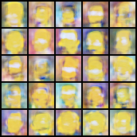
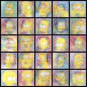
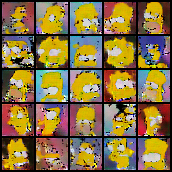

# Résumé de la semaine 2 de stage

## A faire :

- [x]  Mettre à jour l'ordinateur
- [x]  Trouvé un dataset Simpsons
- [x]  Construire un module Dataset torch
- [x]  Trouver un GAN efficace sur le dataset
- [ ] Tunner le GAN jusqu'à avoir un résultats concluant
- [ ] Tester CycleGAN pour transformer des visages humain en Simpsons
- [ ] Prendre en main SDPC
- [ ] Trouver une architecture pour fusionner le GAN et SDPC
- [ ] Evaluer l'intèret de l'architecture
- [ ] Tester BigGan qui promet de bien marcher mais demande beaucoup de ressource : Peut être

## Note d'expériences

Teste GAN10K DCGAN3K AAE10K en 32*32 lr=0.0002 epochs=10000-3000-10000 :
Enfin des expériences d'ampleur
__Résultats__ :
  - GAN : On constate des résultats meilleurs que ceux optenus avec les autres GAN (simple). Un sur-apprentissage apparaît entre les epochs 500 à 600 (environ). 
    Time=4h30
  - DCGAN : Des résultats similaires au précédents 
    Time=5h30
  - AAE : On constate les meilleurs résultats pour le moments, forme des visage, personnages parfois reconnaissable, encore flou tout de même. Les losses semble montrer que l'apprentissage ce pourssuis mais très lentement, D ce rapproche de 0.5 petit à petit.
    Time=5h30

__Conclusion__ :
  - Le système n'est pas encore assez bien paramètrer pour chercher à faire des jobs longs 
  
 

###### Test GAN800 en 32*32 lr=0.0002 epochs=800
Re-Calibrage de GAN10K pour retirer la partie ou le model sur-apprend
__Résultats__ :
  - GAN : On peut voir sur le loss que le générateur perd de plus en plus tendit que le discriminateur gagne

__Conclusion__ :
  - Un sur-apprentissage aparrait
  

###### Test GANless GANmore en 32*32 lr=0.00002-0.0004 epochs=1250
test d'un lr plus faible et plus élever
__Résultats__ :
  - GANless : Bouillie jaune informe, moins bien que GAN800
  - GANmore : Résultats bien meilleur que GANless, le loss montre que le discriminateur est trop bon pour le générateur ce qui semble rapidement stopper l'apprentissage

__Conclusion__ :
  - Le lr doit être plus proche de 0.0004 que de 0.00002

###### Test AAEmore DCGANmore en 32*32 lr=0.0004 epochs=5000-1000
test d'un lr plus élever
__Résultats__ :
  - AAEmore : Résultats casi identique à AAE10K
  - DCGANmore : D apprend mais pas G

__Conclusion__ :
  - Le lr n'est pas le blocage le plus important

###### Test GANUp en 32*32 lr=0.0004 epochs=1000
Tentative d'amèlioration conseiller sur le net. 
Ajout d'une normalization entre -1 et 1 sur les images.
Ajout d'un aléatoire sur les labels (fake = 0.0-0.2 et valid = 0.8-1.0).
Réduction de la batchNormalization (0.8 -> 0.00005).
Remplacement des labels (Valid -> Fake) pour l'entrainement de G.
__Résultats__ :
  - Norm : Bien meilleur résultats visuel (l'ancienne normalization entre 0 et 1 était en contradiction avec la couche tanh du générateur)
  - NormSmooth : Les loss de G et D diverge beaucoup moins
  - NormSmoothBN : Les loss de G et D diverge encore un peut moins
  - NormSmoothBNFlip : Pas bon dutout, mal compri le papier. (déjà pris en compte)

__Conclusion__ :
  - Avant ces modification on constater (cf. GANmore) sur le loss que D gagner alors que G perder,
		cette effet à était grandement réduit grace à Smooth et BN notament.

###### Test DCGANnorm en 32*32 lr=0.0004 epochs=1500
Correction d'un bug dans la normalization (0.1 -> -1.1)
__Résultats__ :
  - DCGANnorm : Meilleur résultats obtenue pour le moment, les visage sont presque cohérent

__Conclusion__ :
  - Ce problème était important et un verroue vers le réalisme est tombé

###### Test AAE5k DCGAN5k en 32*32 lr=0.0004 epochs=5000
test long après la découverte du bug de normalization
__Résultats__ :
  - DCGAN5k : La forme des visages est mieux déssiner, Il y à souvent deux yeux et certaine pupilles commencer à apparaitre. On peut reconnaitre certain personnages.  
  - AAE5k: Les images on des couleurs plus naturel (effet du bug de la normalization). Le résultats est encore flou et de nombreux artefacts entoure les visages.

__Conclusion__ :
  - DCGAN5k est le meilleur modèle tester jusqu'à présent
  - Le bug de la normalization render les images générer plus pale et moins proche du dataset.

###### Test AAEBN+++ AAEBN++ AAEBN+ AAEBN- en 32*32 lr=0.0004 epochs=1000 eps=0.8-0.5-0.005-0.0
test sur le niveau de batchNormalization
__Résultats__ :
  - AAEBN : Il semble que les yeux sont mieux formée quand le eps est grand. Les loss reste casi identique dans les trois cas
  - AAEBN- et AAEBN+++: Le score de ces deux expériences montre que le modèle à commencer à converger avant que D ne prennent le dessus.
		On vois également qu'avec BN- la convergeance arrive plus vite et est plus importante.

__Conclusion__ :
  - Lorsque le loss de D augmente, D classe comme plus vrai les images générées et moins vrai les images réels.
  - Le paramètre epsilon à une influence légère sur la vitesse et la force de convergeance.

###### Test AAEBNLossD en 32*32 lr=0.0004 epochs=1000
Modification du loss de D : loss Dreel = D(E(x)), loss Dfake = D(E(G(z)))
__Résultats__ :
  - AAEBN : Les images sont semblables. Les scores sont inversser et liser, il montrent que D ne ce trompe pas vraiment.

__Conclusion__ :
  - Il est possible qu'il s'agisse d'une reformulations

###### Test GANadvG en 32*32 lr=0.0004 epochs=2000
D semble gagner à chaque fois, on va chercher à le désaventager au profit de G
__Résultats__ :
  - GANlrD (lrD=0.0002): D est ralenti mais la qualité des image n'est pas au rendez-vous.
  - GANhardSmooth (valid=(0.4-1.0),fake=(0.0-0.6)): étonament les meilleurs images pour un GAN. Il semble que D est très frenner.
  - GANliar (liar=1/6, 1/10 et 1/40): Pas de difference visible dans les images. On observe sur le score que D à plus de mal à faire le classement

__Conclusion__ :
  - Le lrD n'a pas fonctionner
  - Le HardSmooth montre de très bon résultats, il est mieux de prendre un nombre random pour chaque batch plutot qu'un random par image (cf gannor et ganuni comparer à HardSmooth).
  - Le mensonge ne donne pas de bon résultats, D est ralenti mais sa n'as pas d'intèret pour autant.

###### Test AAEHSnor DCGANHSnor en 32*32 lr=0.0004 epochs=5000
test du hard smooth après sont succée sur GAN (0.25)
__Résultats__ :
  - DCGAN : Moins net que DCGAN5k mais il semble présenter plus d'éléments du visage.
  - AAE : Des résultats aussi bon que d'habitude, forme du visage flou. Le loss et le score montre que l'apprentissage s'arrète asser vite.

__Conclusion__ :
  - Utiliser un HardSmooth uniform et pas normal
  - Sa n'a pas aider AAE
  - Les résultats avec DCGAN sont mitiger, les images semble plus flou mais le loss de G augmente beaucoup moins

En cours :
 - test : b1 = 0.9, c'est la valeurs par défault
 - GAN+ : *block(1024, 2048), *block(2048, 4096),
 - GAN- :  *block(256, 512),
 - DCGANUp: 4000epochs 
 - GANUp: 40000epochs
