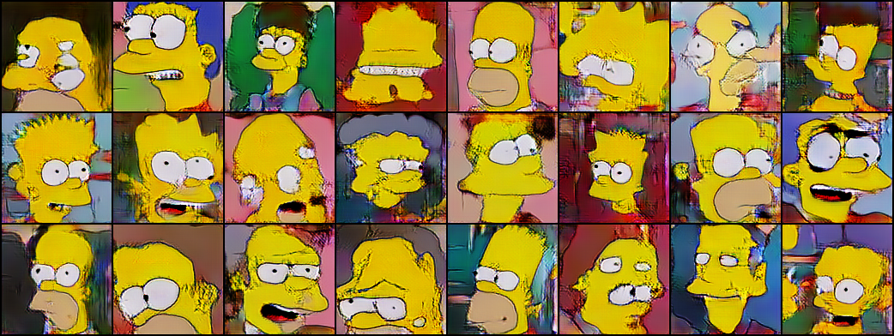

# Résumé de la semaine 23 de stage

## A faire :

- [x]  Mettre à jour l'ordinateur
- [x]  Trouvé un dataset Simpsons
- [x]  Construire un module Dataset torch
- [x]  Nettoyer le dataset Dataset (cf. W10_dataset_dcgan)
- [x]  Trouver un GAN efficace sur le dataset
- [x] Tunner le GAN jusqu'à avoir un résultats concluant
- [ ] Tester CycleGAN pour transformer des visages humain en Simpsons
- [ ] Prendre en main SDPC
- [ ] Trouver une architecture pour fusionner le GAN et SDPC
- [ ] Evaluer l'intèret de l'architecture
- [ ] Tester BigGan qui promet de bien marcher mais demande beaucoup de ressource : Peut être
- [x] Tester une autre représentation pour les images : from skimage.color import rgb2hsv
- [x] Utiliser une méthodes d'augmentation du dataset : https://pytorch.org/docs/stable/torchvision/transforms.html#torchvision.transforms.RandomAffine
- [x] Apprendre à utliser Tensorboard
- [x] Ajout d'un module de scan des paramètre compatible avec tensorboard (cf. current pour plus de détails)
- [x] Ajouter des affichages de résultats plus complets (std, coefficient de variation,..)
- [x] Création d'un dataset baser sur un espace latent connue [cf. ref](http://datashader.org/topics/strange_attractors.html)
- [x] Comprendre et améliorer l'apprentissage de l'auto-encoders 
- [x] Terminer l'expérience sur les espaces latent
- [x] Rapport :
  - [x] Rédaction
  - [x] Références 
  - [x] Mise en forme
  - [x] Illustration
  - [x] Description détaillées des architectures
  - [x] Correction
  - [x] Relecture
- [x] Présentation Orale
  - [x] Diapositive
  - [x] Entrainement
- [x] Mettre le FDD sur Kaggle
  - [x] Ajout d'une description
  - [x] Ajout de description de fichier
  - [x] Ajout d'un kernels
- [ ] Construire le package AEGEAN

## Mise à jour des codes communs

### Utilisation de tensorboard :

1. Dans le code [Tutoriel](https://www.tensorflow.org/guide/summaries_and_tensorboard) [Doc](https://pytorch.org/docs/stable/tensorboard.html)
2. Les codes compatibles sauvegardes les données dans un dossier, par défault `./runs/.`
3. Puis la commande : `tensorboard --logdir=runs`, permet de lancer un serveur pour visualiser ces données durant l'entraînement sur le port 6006.
4. Connexion sur le port 6006 du GPU depuis le port 16006 de l'ordinateur : `ssh -p8012 -L16006:localhost:6006 g14006889@gt-0.luminy.univ-amu.fr`
5. Ouverture d'un navigateur à l'adresse : http://localhost:16006

## Note d'expériences

#### Test Detach en 128x128 epochs=200
Comparaison de AAE avec LossEG et LossE.

__Résultats__ :
  - detach : Résultats attendue.
    Time= 16h
		
__Conclusion__ :
  - Le générateur a appris de façon équivalente  a un DCGAN.
  - L'expérience a était mener sur Simspons Faces, il faut la refaire avec FDD.

#### Test Detach_FDD en 128x128 epochs=200
Comparaison de AAE avec LossEG et LossE sur FDD.

__Résultats__ :
  - detach (gt-2 board) : 
    Time= 
		
__Conclusion__ :
  - :

#### Test G_stride en 128x128 epochs=100
Test de corection du stride de G : 1 => 2

__Résultats__ :
  - Stride2 (gt-0 board): Les images sont constituer de bruits.
    Time= 7h
		
__Conclusion__ :
  - L'utilisation d'un stride 2 pour le générateur ne fonctione pas.

#### Test Interpol_SF en 128x128 epochs=200
Entrainement et sauvegarde d'un model DCGAN_MAX.
Utilisation du model pour crée des interpolation entre different personnages des simpsons.

__Résultats__ :
  - Inter (gt-0 board2): Le model a était entraîner, les images ne sont pas les meilleurs mais devrait suffire. Les 50 dernières epochs sont en mode collapse.
    Time= 
		
__Conclusion__ :
  - :
