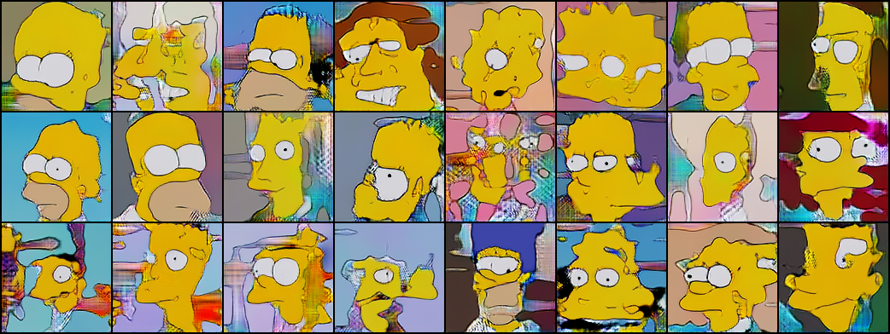
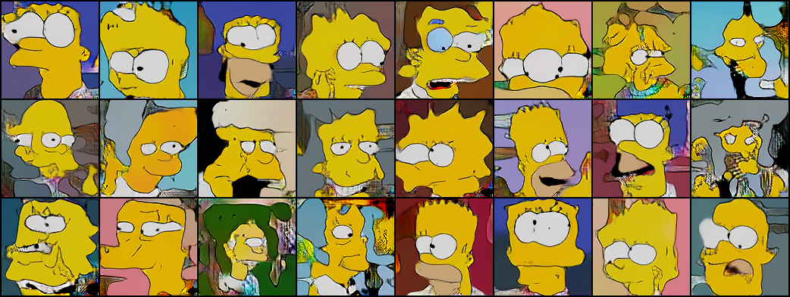
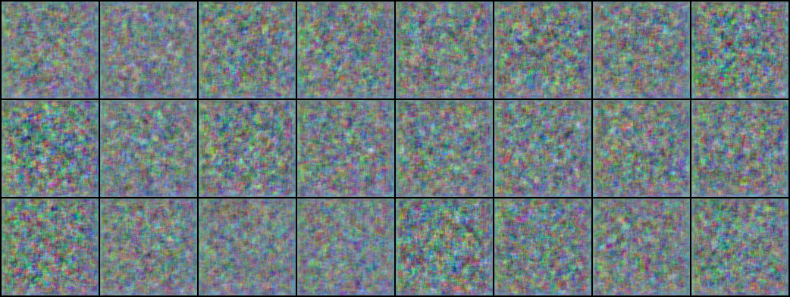
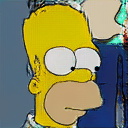
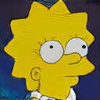

# Résumé de la semaine 24 de stage

## A faire :

- [x]  Mettre à jour l'ordinateur
- [x]  Trouvé un dataset Simpsons
- [x]  Construire un module Dataset torch
- [x]  Nettoyer le dataset Dataset (cf. W10_dataset_dcgan)
- [x]  Trouver un GAN efficace sur le dataset
- [x] Tunner le GAN jusqu'à avoir un résultats concluant
- [ ] Tester CycleGAN pour transformer des visages humain en Simpsons
- [ ] Prendre en main SDPC
- [ ] Trouver une architecture pour fusionner le GAN et SDPC
- [ ] Evaluer l'intèret de l'architecture
- [ ] Tester BigGan qui promet de bien marcher mais demande beaucoup de ressource : Peut être
- [x] Tester une autre représentation pour les images : from skimage.color import rgb2hsv
- [x] Utiliser une méthodes d'augmentation du dataset : https://pytorch.org/docs/stable/torchvision/transforms.html#torchvision.transforms.RandomAffine
- [x] Apprendre à utliser Tensorboard
- [x] Ajout d'un module de scan des paramètre compatible avec tensorboard (cf. current pour plus de détails)
- [x] Ajouter des affichages de résultats plus complets (std, coefficient de variation,..)
- [x] Création d'un dataset baser sur un espace latent connue [cf. ref](http://datashader.org/topics/strange_attractors.html)
- [x] Comprendre et améliorer l'apprentissage de l'auto-encoders
- [x] Terminer l'expérience sur les espaces latent
- [x] Rapport :
  - [x] Rédaction
  - [x] Références
  - [x] Mise en forme
  - [x] Illustration
  - [x] Description détaillées des architectures
  - [x] Correction
  - [x] Relecture
- [x] Présentation Orale
  - [x] Diapositive
  - [x] Entrainement
- [x] Mettre le FDD sur Kaggle
  - [x] Ajout d'une description
  - [x] Ajout de description de fichier
  - [x] Ajout d'un kernels
- [x] Mise à jour de AEGEAN
- [ ] WGAN (cf. W24_WGAN)

## Mise à jour des codes communs

### Utilisation de tensorboard :

1. Dans le code [Tutoriel](https://www.tensorflow.org/guide/summaries_and_tensorboard) [Doc](https://pytorch.org/docs/stable/tensorboard.html)
2. Les codes compatibles sauvegardes les données dans un dossier, par défault `./runs/.`
3. Puis la commande : `tensorboard --logdir=runs`, permet de lancer un serveur pour visualiser ces données durant l'entraînement sur le port 6006.
4. Connexion sur le port 6006 du GPU depuis le port 16006 de l'ordinateur : `ssh -p8012 -L16006:localhost:6006 g14006889@gt-0.luminy.univ-amu.fr`
5. Ouverture d'un navigateur à l'adresse : http://localhost:16006

## Note d'expériences

#### Test WGAN en 128x128 epochs=50
Implémentation de WGAN.
Autant d'entraînement de D et G.

Scan paramètre:
  - clip_value
cf. scan_params.py 

__Résultats__ :
  - WGAN : La méthode semble bien fonctionner mal grès l'absence de paramétrage (autre que clip_value). Pas de signe de collapse, ou du moins rien d'aussi fort que d'habitude (cf. clip_value=0.01). 
    Time=3h (x4)

__Conclusion__ :
  - Le clip_value est important : 
    - Trop bas il bloque tout entraînement (0.001)
    - Trop  haut il semble ne plus aider (0.5). Il est possible que ce paramètres guide l'entraînement, une fois trop haute le guidage ne fait plus effet.  

#### Test WTopK en 128x128 epochs=50
Utilisation d'une fonction personnaliser pour un WGAN.

Scan paramètre:
  - clip_value
cf. scan_params.py 

__Résultats__ :
  - WTopK : 
    Time=

__Conclusion__ :
  - :

#### Test SLERP en 128x128
Interpolation sur des trajectoires circulaire plutôt que des droites.

Modèles de W23_Interpol_SF

__Résultats__ :
  - SLERP : Bart semble ce trouver quelque par entre lisa et homer. Quand on passe d'un visage tourner vers la droite a un tourner vers la gauche il arrive qu'un œil apparaissent tendit qu'un autre apparaît de l'autre coté.
    Time=

__Conclusion__ :
  - L'ajout d'une normalisation [-1,1] sur les points a et b n'as pas d'effet bénéfique 
  - Il est difficile de déterminer si la trajectoire circulaire donne de meilleur résultats que les lignes droites mais il semble que les transitions soit moins abruptes. 

