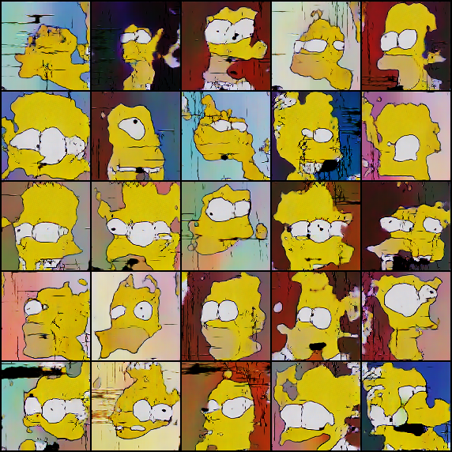

# Résumé de la semaine 3 de stage

## A faire :

- [x]  Mettre à jour l'ordinateur
- [x]  Trouvé un dataset Simpsons
- [x]  Construire un module Dataset torch
- [x]  Trouver un GAN efficace sur le dataset
- [ ] Tunner le GAN jusqu'à avoir un résultats concluant
- [ ] Tester CycleGAN pour transformer des visages humain en Simpsons
- [ ] Prendre en main SDPC
- [ ] Trouver une architecture pour fusionner le GAN et SDPC
- [ ] Evaluer l'intèret de l'architecture
- [ ] Tester BigGan qui promet de bien marcher mais demande beaucoup de ressource : Peut être

## Note d'expériences

##### Test AAEHSuni DCGANHSuni en 32*32 lr=0.0004 epochs=5000
test pour HardSmooth uniform (fake 0.0-0.5 et valid 0.5-1.0) comparé avec AAEHSnor DCGANHSnor
__Résultats__ :
  - DCGAN :
  - AAE  :

__Conclusion__ :

##### Test DCGAN112uni DCGAN112nor en 112*112 lr=0.0004 epochs=5000
test grande taille avec HardSmooth uniform (0.20) et HardSmooth normal (0.20)
__Résultats__ :
  - DCGAN112uni  : Des images nette mais des formes peut cohérentes.
  - DCGAN112nor  :

__Conclusion__ :
  - DCGAN112uni : Les meilleurs résultats pour le moments
  - Erreur sur l'utilisation de la fonction uniform (uniform(0.75, 0.25)), à refaire

##### Test GANLSmod AAELSmod DCGANLSmod en 32*32 lr=0.0004 epochs=1000
D'après [ref](https://github.com/soumith/ganhacks/issues/41) mettre LS uniquement sur les valid de D
HS : uniform( 0.7, 1.0)
__Résultats__ :
  - GAN : Le score fake descent à 0.
  - DCGAN : Un semblant de convergeance au début de l'entrainement  
  - AAE : Une convergeance marqué pendant le début de l'entrainement puis D prend l'avantage

__Conclusion__ :
  - D apprend toujours trop vite et G est dépasser
  

##### Test AAEnoise DCGANnoise GANnoise en 32*32 lr=0.0004 epochs=1000
Ajout d'un bruit aléatoir sur les images réels à chaque batch (mean=0.0,std=0.25)
LS : uniform (0.7, 1.0)
__Résultats__ :
  - GAN : Aucune differrence notable avec ou sans le bruit
  - DCGAN : Le losses de G montrent une grande instabilité lors de l'entrainement. Les images générer ressemble à un bruit jaune.
  - AAE : Une convergeance encore plus marqué qu'avec AAELSmod puis D prend l'avantage

__Conclusion__ :
  - Il semble que l'ajout d'un bruit sois semblable à du Labels Smoothing (pour AAE du moins)
  - Pour DCGAN il semble que G est des pics de gain iréguliers, il serait intéressant d'augmenter le bruit et le nombre d'epochs

##### Test IT en 32*32 lr=0.0004 epochs=1000
InegalTraining, pour le moment les courbes de scores montre que D gagne trop vite pour que G puissent poursuivre sont apprentissage.
L'idée ici est d'apprendre D seulement avant qu'il deviennent trop mauvais, ne jamais converger ou diverger complétement.
Convergeance (0.40, 0.60)
LS : uniform (0.9, 1.0)
__Résultats__ :
  - GAN : Les scores diverge moins mais l'apprentissage de G n'est pas meilleurs pour autant
  - DCGAN :Le score diverge beaucoup moins. Les images sont moins belles qu'avec DCGANLSmod
  - AAE : L'apprentissage ne ce déroule pas correctement

__Conclusion__ :
  - Le score respecte les régles qu'on lui impose mais ce ne sont pas de bonne régles.
  
##### Test noise2 en 32*32 lr=0.0004 epochs=1000
Ajout d'un bruit aléatoire sur les images rééel et générer pour D uniquement, à chaque batch (mean=0.0,std=0.25)
LS : uniform (0.7, 1.0)
__Résultats__ :
  - GAN : On observe des courbes similaire à GANnoise
  - DCGAN : G apprend tout au long des 1000 epochs (cf. losses.png). Les images générer sont classer de plus en plus valid et les images réels ne sont pas classé à 1 (plutot 0.7). 
  - AAE : Les courbes sont très semblable à AAEnoise. Les images semble plus nette qu'avec AAEnoise

__Conclusion__ :
	- Des résultats prometteur pour DCGAN, à approndir : plus d'epochs notamment.
	- Pour GAN et AAE, pas très utile.
	- Erreur ligne 223 influence sur D(x) dans scores.png pour DCGAN et GAN

##### Test noise3 en 32*32 lr=0.0004 epochs=5000
Augmentation du nombre d'epochs de noise2 pour DCGAN et correction du bug d'affichage de scores.png
__Résultats__ :
  - DCGAN : Le losse de G semble montrer qu'il continue d'apprendre lentement mais les scores montre que D classe très bien les images bruitées.

__Conclusion__ :
  - Les courbes semble montrer que G continue à apprendre, peut être à poursuivre.
  - Il est dificile de dire au vue des images si l'apprentissage c'est poursuivi par rapport à Noise2 (peut de difference).

##### Test DCGANlong5k en 32*32 lr=0.0004 epochs=5000
test long avec LabelSmooth uniform (0.9-1.0)
__Résultats__ :
  - DCGAN : Les courbes sont indisponible. On reconnais certains des personnages, ils on deux yeux pour la plupart. Des résultats plus net qu'avec Noise3

__Conclusion__ :
  - DCGAN : Les images semble s'améliorer tout au long de l'apprentissage (difficile à évaluer sans les courbes).

##### Test HyperGAN en 32*32 epochs=5000
Pour diverssifier les GAN tester j'ai décider de tester le dataset sur [HyperGAN](https://github.com/HyperGAN/HyperGAN). 
Les testes sont effectuer avec google collab.
__Résultats__ :
  - HyperGAN : Le modèl converge vers une image qui confond D mais qui n'est pas crédible en tant que visage.

__Conclusion__ :
  - Peut concluant
