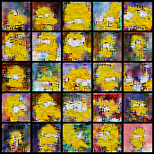
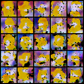
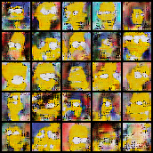

# Résumé de la semaine 5 de stage

## A faire :

- [x]  Mettre à jour l'ordinateur
- [x]  Trouvé un dataset Simpsons
- [x]  Construire un module Dataset torch
- [x]  Trouver un GAN efficace sur le dataset
- [ ] Tunner le GAN jusqu'à avoir un résultats concluant
- [ ] Tester CycleGAN pour transformer des visages humain en Simpsons
- [ ] Prendre en main SDPC
- [ ] Trouver une architecture pour fusionner le GAN et SDPC
- [ ] Evaluer l'intèret de l'architecture
- [ ] Tester BigGan qui promet de bien marcher mais demande beaucoup de ressource : Peut être

## Note d'expériences

#### Test init en 32x32 batchsize=32 epochs=1000
Initialisation des poids différente [ref1](https://github.com/carpedm20/BEGAN-pytorch/issues/7) [ref2](https://stackoverflow.com/questions/49433936/how-to-initialize-weights-in-pytorch) 
Began : decay0.9_evry_Mstall  lr=0.0001 gamma=0.5
Dcgan : decay0.1_evry_1000 lr=0.0004

__Résultats__ :
  - BEGAN : Les première ébauches de Lisa (400) !! On optient des images plus convaincante qu'avec les précédents BEGAN. Le mode collapse apparait plus tard (440). Les courbes montrent un diminution progressive de l'apprentissage.
		Time=5h45
  - DCGAN : On ne constate pas de difference particulière que ce soit au niveau des images ou des courbes, comparer à W4_current_dcgan.
		Time=2h25
		
__Conclusion__ :
  - BEGAN : L'initialisation à permis un bien meilleurs départ et à éviter le mode collapse dès le commencement. Il va falloir jouer sur d'autre paramètres pour maintenir l'apprentissage sur la durré. Lisa est apparrue.
  - DCGAN : Aucun changement

#### Test ABEGAN en 32x32 batchsize=32 epochs=1000 decay0.9_evry_Mstall  lr=0.0001 gamma=0.5
Asymètrique BEGAN
Simplifier la phase de génération par rapport a la phase d'analyse. L'analyse est une tache plus complexe, elle doit necessiter plus de capacité (réseaux plus grand). 

__Résultats__ :
  - BEGAN  : Les images représente seulement homer à la fin de l'entrainment (mode collapse) mais dans une première phase elle ne représente que bart (collapse également mais plus de variation). Les courbes sont très proches des précédentes mais on constate deux picks dans le loss de G au moment où il apprend à générer bart puis homer.
		Time=4h20
		
__Conclusion__ :
  - Forcer k à vouloir toujours être supérieur à 0 ne semble pas être une bonne idée (cf image k standard et k limité), test plus long nécessaire .
  - On constate un apprentissage par phase
  

  
#### Test ReLU en 32x32 batchsize=32 epochs=1000 decay0.9_evry_Mstall  lr=0.0001 gamma=0.5
Remplacement des non-linéarité ELU par ReLU. ReLU est plus standard alors si ELU n'a pas d'effet particulier il vaudra mieux utiliser le standard.
[ELU ref](https://arxiv.org/pdf/1511.07289.pdf)

__Résultats__ :
  - BEGAN : Un mode collapse imédiat. Des courbes similaires à W5_init_began. 
		Time=5h45
		
__Conclusion__ :
  - L'apprentissage ne c'est pas bien dérouler, il semble que ELU aide à retarder le mode collapse.

#### Test SABEGAN en 32x32 batchsize=32 epochs=200 lr=0.0001 gamma=0.5
Simplified Asynmétrique BEGAN
Un réseau pour l'analyse (partie 1 de D), un réseau pour la génération (partager entre G et la seconde partie de D).

__Résultats__ :
  - BEGAN : Image composée d'un unique jaune très claire (Bleu et vert à 255). 
		Time=50m
		
__Conclusion__ :
  - Le code est à revoir.
  
#### Test ADCGAN en 32x32 batchsize=32 epochs=1000 lr=0.0004 
Asynmétrique DCGAN
Un réseau pour l'analyse (partie 1 de D), un réseau pour la génération (partager entre G et la seconde partie de D).

__Résultats__ :
  - DCGAN : Les losses sont en diminution et loss_G fini par être à 0. Les images générer sont composer d'applats de couleurs et ne ressemble pas dutout au simpsons puis finissent par être uniquement composer de bleu une fois que loss_G atteind 0. 
		Time=6h40m
		
__Conclusion__ :
  - Il ce pourrait que pour ce premier test le nombre d'epochs soit trop faible (100).
  - Àprès avoir poursuivi le test jusqu'à 1000 epochs on constate que plus rien n'est appris.
  

  
#### Test Mini en 32x32 batchsize=32 epochs=300 lr=0.0004
Un générateur très simplifier, pour DCGAN, avec juste une couche de convolution cachées.

__Résultats__ :
  - DCGAN kernel size=3: D est bien meilleur que G. Les premières images sont encourageante mais assez vite G atteind les limites de ces capacité.
		Time=45m
  - DCGAN kernel size=8: On voit sur les courbes que G n'apprend rien. Les images sont des amas de pixels sans forme.
		Time=45m
		
__Conclusion__ :
  - Kernel size = 3 
    - G est trop peut capable.
    - Il faudrait essayer de lui donnée de plus gros kernels.
  - Kernel size = 8
    - G est incapable
  - Les capacités de G sont bien trop faible pour le moindre apprentissage.
    

  
#### Test Dropout en 32x32 batchsize=32 epochs=300 lr=0.0004
Evaluation de l'intèret de mettre du Dropout dans le discriminateur de DCGAN.

__Résultats__ :
  - DCGAN 0.0: Les scores sont plus cohérent avec ce qu'on pourrait attendre (D(x)->0.9 et D(G(x))->0.0) ou en tout cas il converge plus vite vers ces valeurs attendue. Le loss_G grimpe plus vite et plus haut (5).  Les images sont beaucoup moins nette sans le dropout.
		Time=50m
  - DCGAN 0.75: La courbe de score montre que les deux courbes divergent très lentement. Le flou présent sans dropout n'apparait pas ici mais les images représente moins des visage.
		Time=50m
		
__Conclusion__ :
  - Dropout=0.0
    - Les courbes semble montrer que la phase d'apprentissage est plus courte sans Dropout mais en contre partis les résultats sont moins beau.
    - Le Dropout semble permettre une période d'apprentissage plus longue et de meilleurs résultats
  - Dropout=0.75
    - Les courbes de score montre que le dropout influe directement sur l'équilibre entre G et D. 
  - L'apprentissage pourrait ce poursuivre bient au delà de 300 epochs.
  - Le niveau de bruit dans les images  générer semblent directement liées au niveau de Dropout, plus il est éléver moins le bruit est présent.

#### Test Logits en 32x32 batchsize=32 epochs=300 lr=0.0004
Utilisation de BCEWithLogits au lieux de BCE pour le calcul du loss.

__Résultats__ :
  - DCGAN : Le loss de G augmente moins vite qu'avec BCE standard (ce qui est bien). Les imges sont couverte d'un bruit, elles sont moins "belle" qu'avec BCE standard. 
		Time=30m
		
__Conclusion__ :
  - Plus rapide que BCE standart (1/3 environ).
  - Réduction de l'augmentation de loss_G
  - Image moins nette qu'avec BCE standard
  

  
Idée : Gamma bas pour éviter mode collapse.
