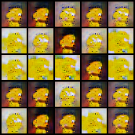

# Résumé de la semaine 5 de stage

## A faire :

- [x]  Mettre à jour l'ordinateur
- [x]  Trouvé un dataset Simpsons
- [x]  Construire un module Dataset torch
- [x]  Trouver un GAN efficace sur le dataset
- [ ] Tunner le GAN jusqu'à avoir un résultats concluant
- [ ] Tester CycleGAN pour transformer des visages humain en Simpsons
- [ ] Prendre en main SDPC
- [ ] Trouver une architecture pour fusionner le GAN et SDPC
- [ ] Evaluer l'intèret de l'architecture
- [ ] Tester BigGan qui promet de bien marcher mais demande beaucoup de ressource : Peut être

## Note d'expériences

##### Test init en 32x32 batchsize=32 epochs=1000
Initialisation des poids différente [ref1](https://github.com/carpedm20/BEGAN-pytorch/issues/7) [ref2](https://stackoverflow.com/questions/49433936/how-to-initialize-weights-in-pytorch) 
Began : decay0.9_evry_Mstall  lr=0.0001 gamma=0.5
Dcgan : decay0.1_evry_1000 lr=0.0004

__Résultats__ :
  - BEGAN : Les première ébauches de Lisa (400) !! On optient des images plus convaincante qu'avec les précédents BEGAN. Le mode collapse apparait plus tard (440). Les courbes montrent un diminution progressive de l'apprentissage.
		Time=5h45
  - DCGAN : On ne constate pas de difference particulière que ce soit au niveau des images ou des courbes, comparer à W4_current_dcgan.
		Time=2h25
		
__Conclusion__ :
  - BEGAN : L'initialisation à permis un bien meilleurs départ et à éviter le mode collapse dès le commencement. Il va falloir jouer sur d'autre paramètres pour maintenir l'apprentissage sur la durré. Lisa est apparrue.
  - DCGAN : Aucun changement

##### Test ABEGAN en 32x32 batchsize=32 epochs=1000 decay0.9_evry_Mstall  lr=0.0001 gamma=0.5
Asymètrique BEGAN
Simplifier la phase de génération par rapport a la phase d'analyse. L'analyse est une tache plus complexe, elle doit necessiter plus de capacité (réseaux plus grand). 

__Résultats__ :
  - BEGAN  : Les images représente seulement homer à la fin de l'entrainment (mode collapse) mais dans une première phase elle ne représente que bart (collapse également mais plus de variation). Les courbes sont très proches des précédentes mais on constate deux picks dans le loss de G au moment où il apprend à générer bart puis homer.
		Time=4h20
		
__Conclusion__ :
  - Forcer k à vouloir toujours être supérieur à 0 ne semble pas être une bonne idée (cf image k standard et k limité), test plus long nécessaire .
  - On constate un apprentissage par phase
  

  
##### Test ReLU en 32x32 batchsize=32 epochs=1000 decay0.9_evry_Mstall  lr=0.0001 gamma=0.5
Remplacement des non-linéarité ELU par ReLU. ReLU est plus standard alors si ELU n'a pas d'effet particulier il vaudra mieux utiliser le standard.
[ELU ref](https://arxiv.org/pdf/1511.07289.pdf)

__Résultats__ :
  - BEGAN : Un mode collapse imédiat. Des courbes similaires à W5_init_began. 
		Time=5h45
		
__Conclusion__ :
  - L'apprentissage ne c'est pas bien dérouler, il semble que ELU aide à retarder le mode collapse.

##### Test SABEGAN en 32x32 batchsize=32 epochs=200 lr=0.0001 gamma=0.5
Simplified Asynmétrique BEGAN
Un réseau pour l'analyse (partie 1 de D), un réseau pour la génération (partager entre G et la seconde partie de D).

__Résultats__ :
  - BEGAN (gt-2): Image composée d'un unique jaune très claire (Bleu et vert à 255). 
		Time=50m
		
__Conclusion__ :
  - Le code est à revoir.
  
##### Test ADCGAN en 32x32 batchsize=32 epochs=100 lr=0.0001 
Asynmétrique DCGAN
Un réseau pour l'analyse (partie 1 de D), un réseau pour la génération (partager entre G et la seconde partie de D).

__Résultats__ :
  - DCGAN (gt-0): Les losses sont en diminution. Les images générer sont composer d'applats de couleurs et ne ressemble pas dutout au simpsons. 
		Time=40m
		
__Conclusion__ :
  - Il ce pourrait que pour ce premier test le nombre d'epochs soit trop faible (100).
  

  
  
Next : Gamma bas pour éviter mode collapse.
