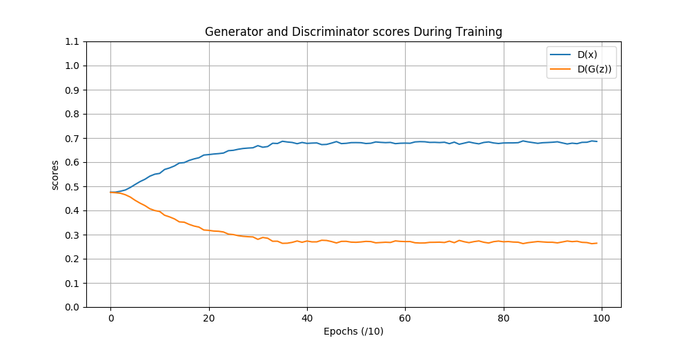

# Résumé de la semaine 6 de stage

## A faire :

- [x]  Mettre à jour l'ordinateur
- [x]  Trouvé un dataset Simpsons
- [x]  Construire un module Dataset torch
- [x]  Trouver un GAN efficace sur le dataset
- [ ] Tunner le GAN jusqu'à avoir un résultats concluant
- [ ] Tester CycleGAN pour transformer des visages humain en Simpsons
- [ ] Prendre en main SDPC
- [ ] Trouver une architecture pour fusionner le GAN et SDPC
- [ ] Evaluer l'intèret de l'architecture
- [ ] Tester BigGan qui promet de bien marcher mais demande beaucoup de ressource : Peut être

## Note d'expériences

##### Test Mini en 32x32 batchsize=32 epochs=300 lr=0.0004
Un générateur très simplifier, pour DCGAN, avec juste deux couche de convolution cachées.

__Résultats__ :
  - DCGAN 
		Time=
		
__Conclusion__ :
  - :
   
  
##### Test Dropout en 32x32 batchsize=32 epochs=1000 lr=0.0004
Poursuite des test de la semaine prècédentes sur le dropout.

__Résultats__ :
  - DCGAN 0.75: Les courbes montre que D n'apprend plus. Difficile de savoir à l'oeil si les images s'amèliore une fois que loss_D commence à stagner.
		Time=2h30m
  - DCGAN 0.5: L'apprentissage ralentie beaucoup après 300epochs mais les images sont meilleur qu'avec le dropout à 0.75 (on vois plus de visage et moins d'artefacts)
		Time=2h20
		
__Conclusion__ :
  - Le modèle semble avoir converger (scores proche de 0.5) pour la première fois !!
  - Le dropout à un impacte sur la vitesse et/ou la capacité du modèle à converger. 
  - Un dropout trop bas (0.0) crée l'apparition de bruit et trop haut (0.75) il empêche l'apparition des visages.

##### Test Treshold en 32x32 batchsize=32 epochs=300 lr=0.0004
G est conforter pour ces création qui trompe le mieux D et mais il est punnis pour ces mauvaises céations. 

__Résultats__ :
  - DCGAN : L'apprentissage ne c'est pas dutout produit. Les images sont en nuances de violet.
		Time=35m
		
__Conclusion__ :
  - La méthodes est à revoir et le code à vérifier .
  
