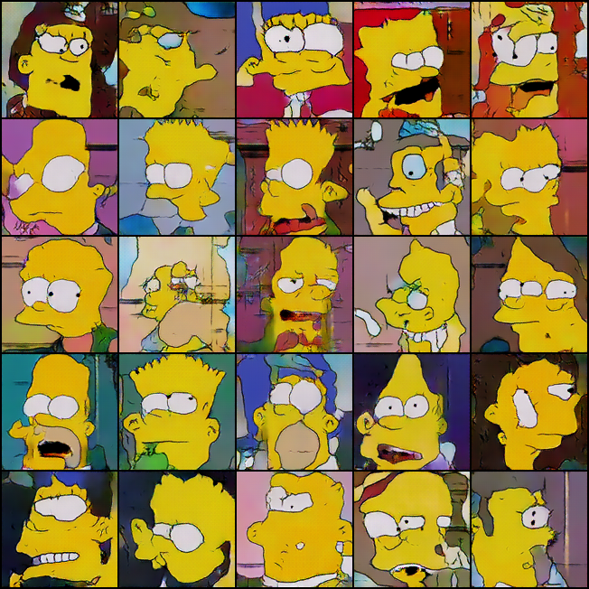
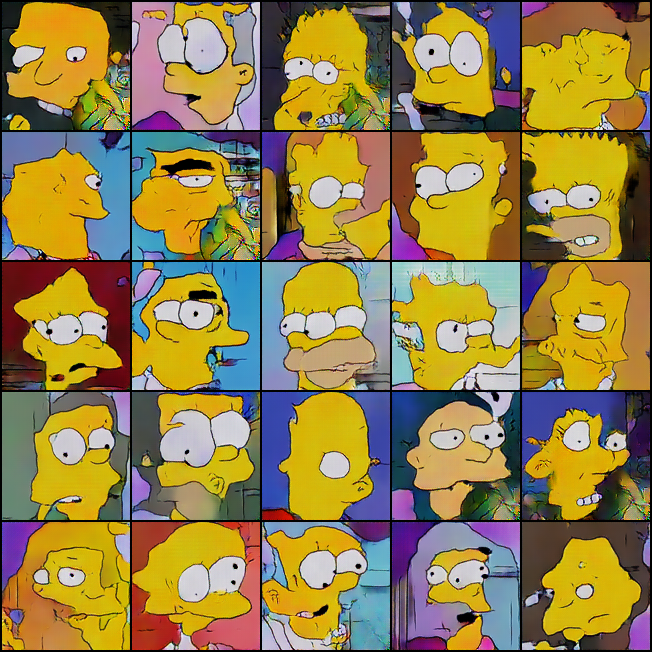
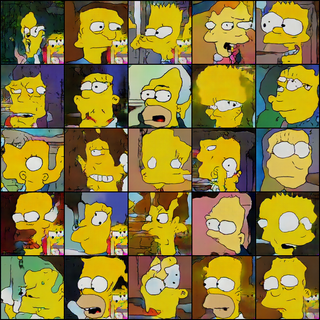
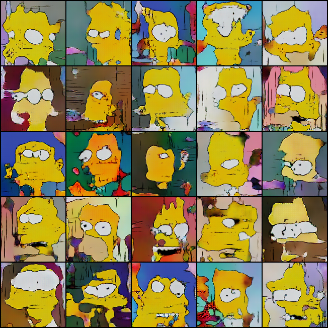
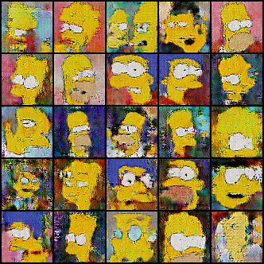
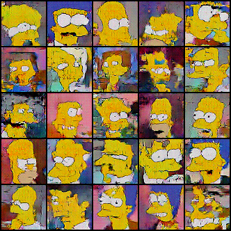
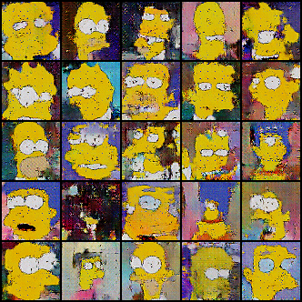
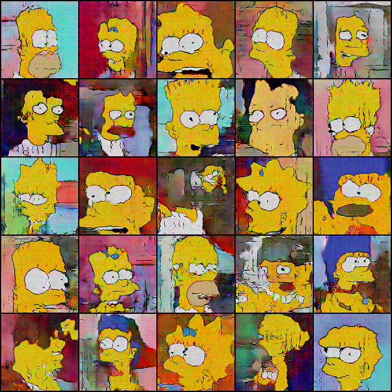

# Résumé de la semaine 7 de stage

## A faire :

- [x]  Mettre à jour l'ordinateur
- [x]  Trouvé un dataset Simpsons
- [x]  Construire un module Dataset torch
- [x]  Trouver un GAN efficace sur le dataset
- [ ] Tunner le GAN jusqu'à avoir un résultats concluant
- [ ] Tester CycleGAN pour transformer des visages humain en Simpsons
- [ ] Prendre en main SDPC
- [ ] Trouver une architecture pour fusionner le GAN et SDPC
- [ ] Evaluer l'intèret de l'architecture
- [ ] Tester BigGan qui promet de bien marcher mais demande beaucoup de ressource : Peut être

## Note d'expériences

#### Test 128 en 128x128 batchsize=32 epochs=400 lrG=0.0004 lrD=0.00004 eps=0.00005
Au vus des résultats de W6_128_dcgan il fallait détailler l'évolution des images avant et pendant les pics des courbes de losses.

__Résultats__ :
  - DCGAN : On retrouve les deux même pics autour de 125 et 180 epochs, comme attendue. Les images en ces deux points sont très differentes du reste de l'entrainement. On constate en 132 et 196, juste après le premier et le deuxième pics, des formes très shématique (rectangulair) avec le visage et des yeux. Le réseau semble passer par une phase de simplication des choses aprises jusqu'ici puis un retour à l'apprentissage rapide (140 204) suivie d'un retour au niveau d'avant le pics (152 244) et enfin des images meilleurs en fin d'apprentissage ().  
		Time=12h20
		
__Conclusion__ :
  - Il semble que les pics sont des zones où l'apprentissage est reboot, probablement que le lr est si grand qu'il permet de sortir du minimum où on ce trouve pour tomber dans un autre creux. A voir après les résultats W7_128lr_dcgan qui visent à tester cette hypothèse. 

#### Test 128lr en 128x128 batchsize=32 epochs=1000 lrG=0.0001 lrD=0.00001 eps=0.00005
Lr plus faible pour voir l'effet sur les pics de l'expérience W6_128_dcgan
Hypothèse : les pics de l'expériences W6_128_dcgan sont du à un lr trop élever.

__Résultats__ :
  - DCGAN : On constate seulement 2 pics là où avec W6_128_dcgan on en avait 4. Les images sont moins belles noatament au niveau de la forme des visages qui n'est pas bien dessiner. 
		Time=17h35
		
__Conclusion__ :
  - Il semble que la réduction du learning rate réduit l'apparition des pics.
  - On constate une baisse de la qualité peut être du à la réduction du nombre de pics.
  - Tester un lr encore plus faible et un plus élever.  

#### Test 128BN en 128x128 batchsize=32 epochs=180-360 lrG=0.0004 lrD=0.00004 eps=0.1
Une batchNormalization plus élever (0.00005 -> 0.1).
Hypothèse : La batchNormalization c'est le bien.

__Résultats__ :
  - DCGAN : Le nombre de pics semble plus important. Les symptomes sont les mêmes que dans W7_128_dcgan. On constate un mode collapse, en 116, qui disparer ensuite.
		Time=3h10m+3h10m
		
__Conclusion__ :
  - Il est très possible que ces pics s'apprente à des redémarrage de l'entrainement dans une autre zone de l'espace des losses.
  - L'augmentation de la BN semble augmenter la fréquence et la durée de ces redémarrage, ce qui peut être une bonne chose.

#### Test 128Treshold en 128x128 batchsize=64 epochs=1000 lrG=0.0004 lrD=0.00004 eps=0.00005
Modification du losses de G.
Les images générer par G qui sont les mieux discriminer par D (D(G(z)) == 0) sont exclue du losses (objectif = 0.5).

__Résultats__ :
  - DCGAN seuil=0.25: Deux pics, après le dernier le model collapse. Peut de variation dans le temps mais plus qu'avec seuil=0.50 .
		Time=17h35
  - DCGAN seuil=0.50 (gt-0 dcgan2): Losses indisponible. Les images générer sont très stable (Toujours le même nombre d'yeux entre 300 et 1000 epoch) durant l'entrainement. On constate une croube de score sans aucun pic. 
		Time=17h30
  - DCGAN seuil=0.75 (gt-2 dcgan2) : Losses indisponible. Un pics à 800. Les images varies lentement et sont un peut meilleur (2 ou 3 visage reconnaissant) qu'avec les seuil infférieurs. Après 600 epochs plusieurs images partage un motif commun dans leur coin bas à droite. 
		Time=17h35
		
__Conclusion__ :
  - :
  

#### Test SGD en 64x64 batchsize=64 epochs=400 lrG=0.0004 lrD=0.00004 eps=0.00005 mumentum=0.9
Test de l'optimizer SGD au lieux de Adam
Comparait avec W7_128_dcgan
Hypothése : La stabilité de SGD est meilleur et évitera peut être l'apparition des pics

__Résultats__ :
  - DCGAN : On constate deux pics sur le loss de G qui on l'effet habituels. Les images produites ne sont pas vraiment meilleur ou pire que W7_128_dcgan mais il est difficile d'en juger.
		Time=9h
		
__Conclusion__ :
  - N'as pas empêcher l'apparition des pics.
  - N'améliore pas significartivement l'apprentissage ou les images générées.
  - Il pourra être intéressent de refaire cette expérience sur un modèle plus aboutit pour mieux constater d'éventuels changement.

#### Test reproduct en 64x64 batchsize=64 epochs=300 lrG=0.0004 lrD=0.00004 eps=0.00005
Reproduction de l'expérience [Image Generator](https://github.com/gsurma/image_generator)
Difference avec W7_128_dcgan:
  - Architecture légérement plus grande (1 couche supplémentaire et plus de filtres) (presque 6 fois plus de paramètre pour G et D)
  - Horizontal random flip (HRF) pour les images
  - Bruit normal_(0.0, random.uniform(0.0, 0.1)) pour les images à l'entrée de D
  - Image de taille 64x64 et pas 128x128
Difference avec [Image Generator](https://github.com/gsurma/image_generator):
  - Kernel taille 4 au lieu de 5
  - Pour G un couche final de conv2d et pas convTranspose2d

__Résultats__ :
  - DCGAN : Les courbes ressemble aux précédentes, on remarque un pic à 225 qui à les effets habituels sur les images générer (image "CMOS"). Les images sont par contre très convaincantes, certain visage sont entièrement dessiner (2 yeux, une bouche (Enfin !), formes général). Presque tout les personnages de la famille sont présent (Sauf Maggie). Après le pics les images sont bien moins convaincante.
		Time=2h9m
		
__Conclusion__ :
  - Les images les plus convaincantes obtenus jusque là, un grand pas franchi.
  - Au delà des léger changement d'architecture (couche suplémentaire), il est probable que le changement majeur viennent du HRF et du bruits ajouter au images réels. Le fond des images pouvant être très differents et détailler dans le dataset, il poussent le réseaux à ce concertrer sur des détails et l'empêche d'apprendre corectement. L'ajout de variation comme le bruit et le HRF permet d'estomper cette dépendance au détails et d'amèliorer la forme général des personnages.
  - Le bruit semble crée un léger flou (applats de couleurs moins unis) dans les images, ce qui était attendue : bruit dans le dataset = bruit dans le résultats.
  - Si l'hypothèse buits+HRF=Bon_résultats est comfirmer (test avec l'architecture de W7_128_dcgan) il sera intérésent de creuser l'idée d'amèliorer et/ou d'augmenter le dataset.

#### Test HRF+noise en 64x64 batchsize=64 epochs=300 lrG=0.0004 lrD=0.00004 eps=0.00005
Hypothèse : L'amélioration constater entre W7_128_dcgan et W7_reproduct_dcgan est dû principalement à HRF et l'ajout d'un bruit aléatoire aux images réels et pas au changement d'architecture.
Difference avec W7_128_dcgan:
  - Horizontal random flip (HRF) pour les images
  - Bruit normal_(0.0, random.uniform(0.0, 0.1)) pour les images à l'entrée de D
  - Image de taille 64x64 et pas 128x128

__Résultats__ :
  - DCGAN : Pas de pics. On peut voir que les images sont vraiment meilleur qu'avec W7_128_dcgan (forme des visage, nombre d'yeux,..). En revanche elle sont un peut moins bonne qu'avec W7_reproduct_dcgan.
		Time=1h40
		
__Conclusion__ :
  - Les résultats observer était attendue :
    - L'ajout du bruit et du HRF on grandement augmenter la qualité général des images (W7_128_dcgan).
    - L'augmentation de la taille de l'architecture des réseaux permet également une amélioration des images (W7_reproduct_dcgan)
  - L'amèlioration dû à l'ajout du bruit laisse penser que le dataset est trop complexe, il faudra peut être trvailler sur sont augmentation et sont nétoyage.

#### Test HRF en 64x64 batchsize=64 epochs=300 lrG=0.0004 lrD=0.00004 eps=0.00005
Hypothèse 1 : L'amélioration constater entre W7_128_dcgan et W7_reproduct_dcgan est dû principalement à HRF et peut au changement d'architecture ou à l'ajout d'un bruit aléatoire aux images réels.
Hypothèse 2 : La forme très régulière des courbes avec HRF+noise sont dû principalment à HRF.
Difference avec W7_128_dcgan:
  - Horizontal random flip (HRF) pour les images
  - Image de taille 64x64 et pas 128x128

__Résultats__ :
  - DCGAN (gt-0 dcgan): 
		Time=
		
__Conclusion__ :
  - :

#### Test DataNoise en 64x64 batchsize=64 epochs=300 lrG=0.0004 lrD=0.00004 taux=0.10-0.05-0.01 bag_size=64
Hypothèse : L'utilisation d'un bruit respectant la distribution du dataset amèliorera l'apprentissage.
On choisi @bag_size images du datatset, on met les pixels de ces images dans un sac, on pioche un nombre de pixel dans le sac et on les place aléatoirement dans les images réel du batch.  

Comparer avec W7_HDF+noise_dcgan

__Résultats__ :
  - DCGAN taux = 0.05: Les courbes sont très proche de W7_HDF+noise_dcgan, ce qui laisse penser que l'impacte de HDF sur les courbes est très important ou que les deux type de bruitage sont proches (ce qui serait étonant). Les images présente des points noirs qui est apriori directement liée à la méthodes de bruitage. Les images sont moins bonne qu'avec la méthodes de bruitage précédentes
		Time=1h40m
  - DCGAN taux = 0.01 (gt-2 dcgan):
  		Time=
  - DCGAN taux = 0.10:
  		Time=
  		
__Conclusion__ :
  - L'impact du HRF explique peut être une grande par de l'amèlioration entre W7_128_dcgan et W7_reproduct_dcgan. A vérifier
  - Le réglage du taux est peut être trop fort (5% tout de même), ou trop faible, il faut tester
  - Le bruit sur l'ensemble de l'image semble une meileur idée que le bruit sur une part de l'image 

")

#### Test reproduct128 en 128x128 batchsize=64 epochs=500 lrG=0.0004 lrD=0.00004 eps=0.00005
Augmentation de la taille et du nombre d'epochs pour W7_reproduct_dcgan

__Résultats__ :
  - DCGAN : Aucun pics sur les courbes, étrange... Des visage de simpsons !! Deux yeux, une bouches, une identité reconnaissable ! La plupart sont encore cauchemardesques mais certains sont vraiment "proche" du réel.
		Time=12h45
		
__Conclusion__ :
  - Très bons résultats comparer notament à W7_128_dcgan
  - Les résultats sont encore moins bon que ceux de l'[expérience d'origine](https://github.com/gsurma/image_generator), probablement à cause des difference d'achitecture qui subsiste (cf W7_reproduct_dcgan). 
  - Confirmation des résultats en 64x64 de W7_reproduct_dcgan.
  - On ne sais pas encore quel est la part d'influence de l'ajout du bruit et de l'agrandissement de l'architecture.
  

