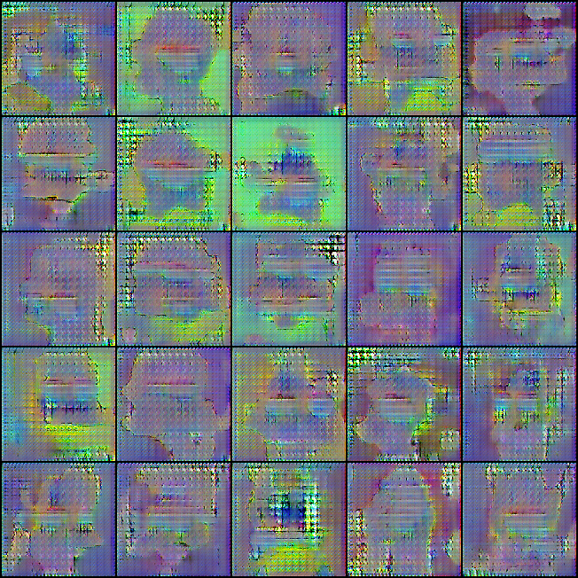
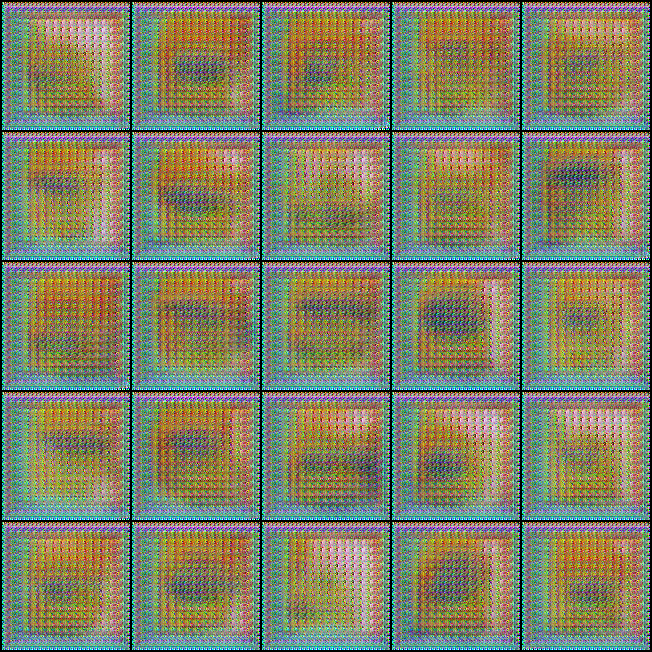
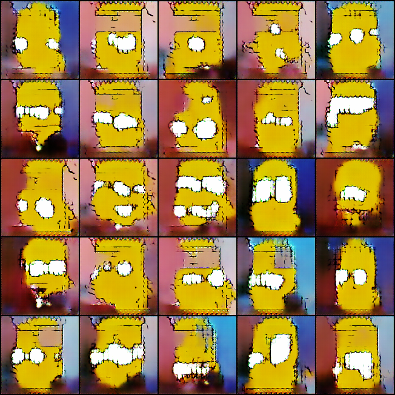

# Résumé de la semaine 7 de stage

## A faire :

- [x]  Mettre à jour l'ordinateur
- [x]  Trouvé un dataset Simpsons
- [x]  Construire un module Dataset torch
- [x]  Trouver un GAN efficace sur le dataset
- [ ] Tunner le GAN jusqu'à avoir un résultats concluant
- [ ] Tester CycleGAN pour transformer des visages humain en Simpsons
- [ ] Prendre en main SDPC
- [ ] Trouver une architecture pour fusionner le GAN et SDPC
- [ ] Evaluer l'intèret de l'architecture
- [ ] Tester BigGan qui promet de bien marcher mais demande beaucoup de ressource : Peut être

## Note d'expériences

#### Test 128 en 128x128 batchsize=32 epochs=400 lrG=0.0004 lrD=0.00004 eps=0.00005
Au vus des résultats de W6_128_dcgan il fallait détailler l'évolution des images avant et pendant les pics des courbes de losses.

__Résultats__ :
  - DCGAN : On retrouve les deux même pics autour de 125 et 180 epochs, comme attendue. Les images en ces deux points sont très differentes du reste de l'entrainement. On constate en 132 et 196, juste après le premier et le deuxième pics, des formes très shématique (rectangulair) avec le visage et des yeux. Le réseau semble passer par une phase de simplication des choses aprises jusqu'ici puis un retour à l'apprentissage rapide (140 204) suivie d'un retour au niveau d'avant le pics (152 244) et enfin des images meilleurs en fin d'apprentissage ().  
		Time=12h20
		
__Conclusion__ :
  - Il semble que les pics sont des zones où l'apprentissage est reboot, probablement que le lr est si grand qu'il permet de sortir du minimum où on ce trouve pour tomber dans un autre creux. A voir après les résultats W7_128lr_dcgan qui visent à tester cette hypothèse. 

#### Test 128lr en 128x128 batchsize=32 epochs=1000 lrG=0.0001 lrD=0.00001 eps=0.00005
Lr plus faible pour voir l'effet sur les pics de l'expérience W6_128_dcgan
Hypothèse : les pics de l'expériences W6_128_dcgan sont du à un lr trop élever.

__Résultats__ :
  - DCGAN : On constate seulement 2 pics là où avec W6_128_dcgan on en avait 4. Les images sont moins belles noatament au niveau de la forme des visages qui n'est pas bien dessiner. 
		Time=17h35
		
__Conclusion__ :
  - Il semble que la réduction du learning rate réduit l'apparition des pics.
  - On constate une baisse de la qualité peut être du à la réduction du nombre de pics.
  - Tester un lr encore plus faible et un plus élever.  

#### Test 128BN en 128x128 batchsize=32 epochs=180-360 lrG=0.0004 lrD=0.00004 eps=0.1
Une batchNormalization plus élever (0.00005 -> 0.1).
Hypothèse : La batchNormalization c'est le bien.

__Résultats__ :
  - DCGAN : Le nombre de pics semble plus important. Les symptomes sont les mêmes que dans W7_128_dcgan. On constate un mode collapse, en 116, qui disparer ensuite.
		Time=3h10m+3h10m
		
__Conclusion__ :
  - Il est très possible que ces pics s'apprente à des redémarrage de l'entrainement dans une autre zone de l'espace des losses.
  - L'augmentation de la BN semble augmenter la fréquence et la durée de ces redémarrage, ce qui peut être une bonne chose.

#### Test 128Treshold en 128x128 batchsize=32 epochs=180-360-1000 lrG=0.0004 lrD=0.00004 eps=0.00005
Modification du losses de G.
Les images générer par G qui sont les mieux discriminer par D (D(G(z)) == 0) sont exclue du losses (objectif = 0.5).

__Résultats__ :
  - DCGAN (gt-0 dcgan2): Le loss contrairement a W6_treshold_dcgan à une forme en cloche proche de d'habitude. Le run termine sur un pics semblable a ceux observer dans les expériences précédentes.
		Time=3h20+3h10
		
__Conclusion__ :
  - Il faut plus d'epochs pour mieux comprendre ce qu'il ce passe.

#### Test reproduct en 128x128 batchsize=64 epochs=300 lrG=0.0004 lrD=0.00004 eps=0.00005
Reproduction de l'expérience [Image Generator](https://github.com/gsurma/image_generator)

__Résultats__ :
  - DCGAN (gt-0 dcgan):
		Time=
		
__Conclusion__ :
  - :
