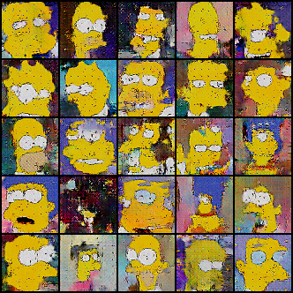

# Résumé de la semaine 8 de stage

## A faire :

- [x]  Mettre à jour l'ordinateur
- [x]  Trouvé un dataset Simpsons
- [x]  Construire un module Dataset torch
- [x]  Trouver un GAN efficace sur le dataset
- [ ] Tunner le GAN jusqu'à avoir un résultats concluant
- [ ] Tester CycleGAN pour transformer des visages humain en Simpsons
- [ ] Prendre en main SDPC
- [ ] Trouver une architecture pour fusionner le GAN et SDPC
- [ ] Evaluer l'intèret de l'architecture
- [ ] Tester BigGan qui promet de bien marcher mais demande beaucoup de ressource : Peut être
- [ ] from skimage.color import rgb2hsv
- [ ] https://pytorch.org/docs/stable/torchvision/transforms.html#torchvision.transforms.RandomAffine

## Note d'expériences

#### Test HRF en 64x64 batchsize=64 epochs=300 lrG=0.0004 lrD=0.00004 eps=0.00005
Hypothèse 1 : L'amélioration constater entre W7_128_dcgan et W7_reproduct_dcgan est dû principalement à HRF et peut au changement d'architecture ou à l'ajout d'un bruit aléatoire aux images réels.
Hypothèse 2 : La forme très régulière des courbes avec HRF+noise sont dû principalement à HRF.
Différence avec W7_128_dcgan:
  - Horizontal random flip (HRF) pour les images
  - Image de taille 64x64 et pas 128x128

__Résultats__ :
  - DCGAN : Les courbes sont très stable (juste un peut moins de dans W7_HRF+noise_dcgan ) et on la même forme que dans W7_HRF+noise_dcgan. Les images générer on la structure de visage (pour la plupart) et les aplats de couleurs sont nets. Les images sont meilleurs (dans leurs structuration notamment) que W7_128_dcgan et on y voit moins de visage correcte que dans W7_HRF+noise_dcgan.
		Time=3h40 (Pas seul)

__Conclusion__ :
  - Vus la nette amélioration entre W7_128_dcgan et cette expérience on peut dire que le HRF améliore grandement la qualité des résultats.
  - Hypothèse 2 : En comparent les courbes à celles de W7_128_dcgan et W7_HRF+Noise on peut dire que la forme très stable observer ici et dans W7_HRF+Noise est du à HRF et pas au noise.
  - Hypothèse 1 : Concernant W7_HRF+Noise, l'ajout du bruit permet une amélioration de l'apprentissage de la structure des visages tout en ajoutant un bruit au images générées (assez logique vus que les images que connaît D sont toutes bruitées). 
  - Vus l'amélioration apporté par HDF et noise (W7_HRF+Noise et W7_HRF) , on peut dire que le dataset pose des problèmes lors de l'apprentissage et les techniques d'augmentation du dataset fonctionne bien.

#### Test DataNoise en 64x64 batchsize=64 epochs=300 lrG=0.0004 lrD=0.00004 taux=0.10-0.05-0.01 bag_size=64
Hypothèse : L'utilisation d'un bruit respectant la distribution du dataset améliorera l'apprentissage.
On choisi @bag_size images du datatset, on met les pixels de ces images dans un sac, on pioche un nombre de pixel dans le sac et on les places aléatoirement dans les images réel du batch.  
On à un HRF

Comparer avec W7_HRF+noise_dcgan

__Résultats__ :
  - DCGAN taux = 0.05: Les courbes sont très proche de W7_HRF+noise_dcgan, ce qui laisse penser que l'impacte de HRF sur les courbes est très important ou que les deux type de bruitage sont proches (ce qui serait étonnant). Les images présente des points noirs qui est apriori directement liée à la méthodes de bruitage. Les images sont moins bonne qu'avec la méthodes de bruitage précédentes
		Time=1h40m
  - DCGAN taux = 0.01 : Les courbes sont plus stable qu'avec seulement HRF. Les points noirs et autres artefacts sont beaucoup moins présent qu'avec un seuil à 0.05 et la qualité est très proches.
  		Time=3h40 (Pas seul)
  - DCGAN taux = 0.10:
  		Time=

__Conclusion__ :
  - L'impact du HRF explique peut être une grande par de l'amélioration entre W7_128_dcgan et W7_reproduct_dcgan. A vérifier : D'après W7_HRF c'est bien le cas.
  - Ce bruit à pour objectif de mieux respecter la distribution du dataset mais le bruit sur l'ensemble de l'image (cf. W7_HRF+Noise) respectent déjà la distribution de probabilité puisque la variation est appliquer sur les pixels d'origine de l'image (donc provenant du dataset). 
  - Cette méthodes de bruitage crée donc d'importante irrégularité dans la position d'un pixels par rapport à ces voisins et donc elle crée des structure qui n'existent pas dans le dataset.

#### Test extrem en 64x64 batchsize=64 epochs=300 lrG=0.0004 lrD=0.00004 eps=0.00005
Hypothèse : D donne des réponse parfois extreme qui noie la valeur des autres réponse.

Copie de W7_HRF+Noise

__Résultats__ :
  - DCGAN : On peut voir sur la nouvel figure (cf. min.png) que les réponse donnée par D sont de moins en moins stable d'un batch à l'autre. Une zone à partir de laquel la réponse D(x) est souvent égale à REAL montre que D à gagner et perd de moins en moins.
		Time=1h40
		
__Conclusion__ :
  - Les courbes générer ne sont pas informative, il va falloir reprendre tout ça.
  - Il faut s'occuper des histogramme

#### Test lossD en 64x64 batchsize=64 epochs=300 lrG=0.0004 lrD=0.00004 eps=0.00005
Hypothèse : Le loss de D est calculer sur deux fois plus d'images que celui de G donc D est avantager par rapport à G.
Idée 1 : Diviser le loss de D par 2
Idée 2 : Montrer deux fois moins d'images à D (aussi bien pour real que fake)

Copie de W7_HRF+Noise

__Résultats__ :
  - Idée 1 : Aucun changement inattendue dans les courbes, le loss de D est juste diviser par 2. Le score reste in-changer. La division par deux n'a pas d'impacte sur l'entraînement
		Time=
  - Idée 2 (gt-2 dcgan2): Il semble que l'apprentissage soit devenue plus lent : le croisement des deux losses arrive plus tard et les courbes de scores sont légèrement plus smooth.
		Time=1h20
		
__Conclusion__ :
  - Ces deux idée n'ont pas permise de contraindre D à perdre, ou en tout cas de mener à l'équilibre. 
  
#### Test MNIST en 32x32 batchsize=64 epochs=200 
Le loss de G augmente durant l'entraînement sans que l'ont puisse l'expliquer par la théorie.
Pour vérifier qu'il ne s’agit pas d'une erreur d'implémentation il faut tester d'autre code pré-existant et qui montrent des résultats concluant, avec leurs propre dataset et si possible en pytorch.

Code tester :
  - (Pytorch-GAN)[https://github.com/eriklindernoren/PyTorch-GAN#deep-convolutional-gan]
  - (PGMC)[https://github.com/znxlwm/pytorch-generative-model-collections/blob/master/GAN.py]

__Résultats__ :
  - Pytorch-GAN : Les images générer sont bien des chiffres MNIST convaincant. Les courbes présente les même caractéristique que les nôtres, notamment le loss de G augmente.
		Time=4h30
  - PGMC : Les images générer sont bien des chiffres MNIST convaincant. Le loss de G augmente. 
		Time=35m
		
__Conclusion__ :
  - Au vus de ces résultats venue de code et de dataset différent du notre on peut en conclure que le loss de G est bien sensé augmenter.
  - Il va falloir comprendre d'où vient ce problème de compréhension théorique.

#### Test Current en 64x64 batchsize=64 epochs=1000 
Mise à jour et retour à un GAN simplifier, sans tricks d'entraînement.

__Résultats__ :
  - DCGAN : On peut noter que lossG ce déstabilise durant l'entraînement. La déstabilisation semble liée avec le mode collapse (à 300 pas de collapse et peut de déstabilisation, à 610 une forte déstabilisation et un fort collaspe)
		Time=1h50m
		
__Conclusion__ :
  - Version stable et nettoyer.
  - Il semble y avoir un lien entre collapse et déstabilisation de lossG 
  - Le système pourrait bien avoir "converger", il semble que la convergence des GANs puisse ne pas être à 0 (ref)[https://stackoverflow.com/questions/42690721/how-to-interpret-the-discriminators-loss-and-the-generators-loss-in-generative] 

#### Test PerfectG en 64x64 batchsize=64 epochs=300 
Que ce passe t-il si G devient presque parfait ?
Pour simuler un G parfait, à un moment de l'entraînement on remplace les images générer par des images du dataset avec un bruit normal (G(z) devient x+noise).
Hypothèse : Comme D après quelque epochs est devenus très bon on peut s'attendre à ce qu'il deviennent incapable de différencier x et x+noise (ou moins dans un premier temps). 

__Résultats__ :
  - DCGAN : 
		Time=
		
__Conclusion__ :
  -

#### Test Long en 64x64 batchsize=64 epochs=5000 
Le lossG reste t-il stable après beaucoup d'epochs
HRF et noise (pour D(x) et D(G(z))) pour améliorer la stabilité 
Hypothèse : Le lossG converge vers un nombre arbitraire (qui n'est pas 0) alors que lossD converge vers 0

__Résultats__ :
  - DCGAN :
		Time=
		
__Conclusion__ :
  - 
