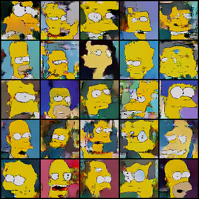

# Résumé de la semaine 7 de stage

## A faire :

- [x]  Mettre à jour l'ordinateur
- [x]  Trouvé un dataset Simpsons
- [x]  Construire un module Dataset torch
- [x]  Trouver un GAN efficace sur le dataset
- [ ] Tunner le GAN jusqu'à avoir un résultats concluant
- [ ] Tester CycleGAN pour transformer des visages humain en Simpsons
- [ ] Prendre en main SDPC
- [ ] Trouver une architecture pour fusionner le GAN et SDPC
- [ ] Evaluer l'intèret de l'architecture
- [ ] Tester BigGan qui promet de bien marcher mais demande beaucoup de ressource : Peut être
- [ ] from skimage.color import rgb2hsv
- [ ] https://pytorch.org/docs/stable/torchvision/transforms.html#torchvision.transforms.RandomAffine

## Note d'expériences

#### Test HRF en 64x64 batchsize=64 epochs=300 lrG=0.0004 lrD=0.00004 eps=0.00005
Hypothèse 1 : L'amélioration constater entre W7_128_dcgan et W7_reproduct_dcgan est dû principalement à HRF et peut au changement d'architecture ou à l'ajout d'un bruit aléatoire aux images réels.
Hypothèse 2 : La forme très régulière des courbes avec HRF+noise sont dû principalment à HRF.
Difference avec W7_128_dcgan:
  - Horizontal random flip (HRF) pour les images
  - Image de taille 64x64 et pas 128x128

__Résultats__ :
  - DCGAN : Les courbes sont très stable (juste un peut moins de dans W7_HRF+noise_dcgan ) et on la même forme que dans W7_HRF+noise_dcgan. Les images générer on la structure de visage (pour la pluparts) et les aplats de couleurs sont nets. Les images sont meilleurs (dans leurs structuration notamment) que W7_128_dcgan et on y voit moins de visage corecte que dans W7_HRF+noise_dcgan.
		Time=3h40 (Pas seul)

__Conclusion__ :
  - Vus la nette amélioration entre W7_128_dcgan et cette expérience on peut dire que le HRF amèliore grandement la qualité des résultats.
  - Hypothèse 2 : En comparent les courbes à celles de W7_128_dcgan et W7_HRF+Noise on peut dire que la forme très stable observer ici et dans W7_HRF+Noise est du à HRF et pas au noise.
  - Hypothèse 1 : Concernant W7_HRF+Noise, l'ajout du bruit permet une amélioration de l'apprentissage de la structure des visages tout en ajoutant un bruit au images générées (assez logique vus que les images que connait D sont toutes bruitées). 
  - Vus l'amèlioration apporté par HDF et noise (W7_HRF+Noise et W7_HRF) , on peut dire que le dataset pose des problèmes lors de l'apprentissage et les techniques d'augmentation du dataset fonctionne bien.

#### Test DataNoise en 64x64 batchsize=64 epochs=300 lrG=0.0004 lrD=0.00004 taux=0.10-0.05-0.01 bag_size=64
Hypothèse : L'utilisation d'un bruit respectant la distribution du dataset amèliorera l'apprentissage.
On choisi @bag_size images du datatset, on met les pixels de ces images dans un sac, on pioche un nombre de pixel dans le sac et on les places aléatoirement dans les images réel du batch.  
On à un HRF

Comparer avec W7_HRF+noise_dcgan

__Résultats__ :
  - DCGAN taux = 0.05: Les courbes sont très proche de W7_HRF+noise_dcgan, ce qui laisse penser que l'impacte de HRF sur les courbes est très important ou que les deux type de bruitage sont proches (ce qui serait étonant). Les images présente des points noirs qui est apriori directement liée à la méthodes de bruitage. Les images sont moins bonne qu'avec la méthodes de bruitage précédentes
		Time=1h40m
  - DCGAN taux = 0.01 : Les courbes sont plus stable qu'avec seulement HRF. Les points noirs et autres artefacts sont beaucoup moins présent qu'avec un seuil à 0.05 et la qualité est très proches.
  		Time=3h40 (Pas seul)
  - DCGAN taux = 0.10:
  		Time=

__Conclusion__ :
  - L'impact du HRF explique peut être une grande par de l'amèlioration entre W7_128_dcgan et W7_reproduct_dcgan. A vérifier : D'après W7_HRF c'est bien le cas.
  - Ce bruit à pour objectif de mieux respécter la distribution du dataset mais le bruit sur l'ensemble de l'image (cf. W7_HRF+Noise) respectent déjà la distribution de probabilité puisque la variation est appliquer sur les pixels d'origine de l'image (donc provenant du dataset). 
  - Cette méthodes de bruitage crée donc d'importante irégularité dans la position d'un pixels par rapport à ces voisins et donc elle crée des structure qui n'existent pas dans le dataset.

#### Test extrem en 64x64 batchsize=64 epochs=300 lrG=0.0004 lrD=0.00004 eps=0.00005
Hypothèse : D donne des réponse parfois extreme qui noye la valeur des autres réponse.

Copie de W7_HRF+Noise

__Résultats__ :
  - DCGAN : On peut voir sur la nouvel figure (cf. min.png) que les réponse donnée par D sont de moins en moins stable d'un batch à l'autre. Une zone à partir de laquel la réponse D(x) est souvent égale à REAL montre que D à gagner et perd de moins en moins.
		Time=1h40
		
__Conclusion__ :
  - Les courbes générer ne sont pas informative, il va falloir repprendre tout ça.
  - Il faut s'occuper des histogramme

#### Test lossD en 64x64 batchsize=64 epochs=300 lrG=0.0004 lrD=0.00004 eps=0.00005
Hypothèse : Le loss de D est calculer sur deux fois plus d'images que celui de G donc D est avantager par rapport à G.
Idée 1 : Diviser le loss de D par 2
Idée 2 : Montrer deux fois moins d'images à D (aussi bien pour real que fake)

Copie de W7_HRF+Noise

__Résultats__ :
  - Idée 1 : Aucun changement inatendue dans les courbes, le loss de D est juste diviser par 2. Le score reste inchanger. La division par deux n'a pas d'impacte sur l'entrainement
		Time=
  - Idée 2 (gt-2 dcgan2): Il semble que l'apprentissage soit devenue plus lent : le croissement des deux losses arrive plus tard et les courbes de scores sont légèrement plus smooth.
		Time=1h20
		
__Conclusion__ :
  - :
  
  
En cours :
gt-0 dcgan : current standart
gt-0 dcgan2 : DCGAN MNIST
