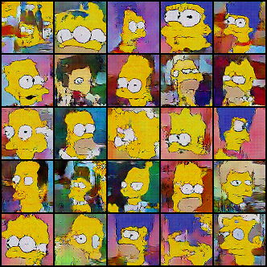

# Résumé de la semaine 9 de stage

## A faire :

- [x]  Mettre à jour l'ordinateur
- [x]  Trouvé un dataset Simpsons
- [x]  Construire un module Dataset torch
- [x]  Trouver un GAN efficace sur le dataset
- [ ] Tunner le GAN jusqu'à avoir un résultats concluant
- [ ] Tester CycleGAN pour transformer des visages humain en Simpsons
- [ ] Prendre en main SDPC
- [ ] Trouver une architecture pour fusionner le GAN et SDPC
- [ ] Evaluer l'intèret de l'architecture
- [ ] Tester BigGan qui promet de bien marcher mais demande beaucoup de ressource : Peut être
- [x] from skimage.color import rgb2hsv
- [ ] https://pytorch.org/docs/stable/torchvision/transforms.html#torchvision.transforms.RandomAffine

## Note d'expériences

#### Test PerfectG en 64x64 batchsize=64 epochs=300-100 bascule=150-60
Que ce passe t-il si G devient presque parfait ?
Pour simuler un G parfait, à un moment de l'entraînement on remplace les images générer par des images du dataset avec un bruit normal (G(z) devient x+noise).
Hypothèse : Comme D après quelque epochs est devenus très bon on peut s'attendre à ce qu'il deviennent incapable de différencier x et x+noise (au moins dans un premier temps). 

Evry-noise : Ajout d'un bruit tel que D(x+noise) (au lieu de D(x)) lors de l'entraînement de D pour empêcher D de comprendre que les images avec un bruit sont générer
__Résultats__ :
  - DCGAN (e=300 b=150): Après le point de bascule D ne semble plus apprendre (sont score est bloquer autour de D(x)0.9 et D(G(z))0.05). D est toujours capable de différencier x et G(z). On remarque un pics de lossD au moment de la bascule.
		Time=1h10m
  - DCGAN (e=100 b=60): On constate les même types de scores que pour une bascule à 150 mais pas de pics pour le loss.
		Time=25m
  - DCGAN (e=100 b=60 evry_noise): Le score montre que D est incapable de différencier x de G(z). L'apprentissage à était ralentie par l'ajout du bruit sur D(x).
		Time=50m
				
__Conclusion__ :
  - Hypothèse : Dans l'expérience DCGAN (e=100 b=60) on ne constate pas du tout l'incapacité de détermination de D. Probablement que D est rapidement capable de "comprendre" qu'une image avec du bruit est un fake. Il faut refaire l'expérience avec un bruit sur chaque entrées.
  - Le pics de lossD au point de bascule suggère que D devient "relativement" mauvais le temps de comprendre comment différencier ces nouvelles images.
  - On pourrait essayer d'introduire des images x+noise dans les images générer régulièrement (cf. W9_Lying)
  - Hypothèse : On constate bien le résultats prédit, le score devient plat à 0.5, D devient incapable de différencier x+noise et G(z) (ce qui est bien normal puisque G(z)=x+noise ici)

#### Test Long en 64x64 batchsize=64 epochs=5000 
Le lossG reste t-il stable après beaucoup d'epochs
HRF et noise (pour D(x) et D(G(z))) pour améliorer la stabilité 
Hypothèse : Le lossG converge vers un nombre arbitraire (qui n'est pas 0) alors que lossD converge vers 0

__Résultats__ :
  - DCGAN : Le lossG est séparer en trois phases distinct : Une première part ou il augmente jusqu'à environ 13 points (0-2000epochs) suivi par un pics plutôt long (2150-2300epochs) et une dernière phase agiter qui semble avoir converger autour de 13 point de loss.
		En observant les images on constate que l'apprentissage ce déroule correctement durant la première moitié de la première phase avant de lentement dégénérer. Un fois arriver au pics le modèle collapse complètement et ne génère plus que des bouillie de couleur vaguement structurer. Dans la dernière phase on retrouve des visages de simspons à peut près structurer ainsi qu'un important collapse. 
		Time=27h50m
		
__Conclusion__ :
  - Cette expérience laisse penser que le loss de G n'est pas sensé converger à 0, comme suggérer ici (ref)[https://stackoverflow.com/questions/42690721/how-to-interpret-the-discriminators-loss-and-the-generators-loss-in-generative]   
  - On constate également que le modèle à complètement perdue les pédales au bout d'un certain temps et qu'à cette instant D n'a plus fait d'erreur.
  
#### Test Lying en 64x64 batchsize=64 epochs=300 t=6
HRF et noise (pour D(x) et D(G(z))) pour améliorer la stabilité 
Introduire des images réels+noise dans les batch d'image générer (Négatif) ou les meilleurs images générer dans les batchs réels (Positif).

__Résultats__ :
  - Negatif (relancer):  
		Time=1h45
  - Positif (gt_2 dcgan2): Les courbes sont très proche des expériences précédentes (cf. W8_HRF) à part un pics sur la fin durant lequel D ne fait plus d'erreur.
		Time=2h25
		
__Conclusion__ :
  - 
  

  
#### Test HSV en 64x64 batchsize=64 epochs=300
Utilisation du format HSV pour les images

__Résultats__ :
  - DCGAN (gt-0 dcgan2): Les courbes "identique" à celle de W8_current (e=300 et 64x64).
		Time=1h40
		
__Conclusion__ :
  - Les images générer sont très bien mais il faudrait les comparées avec des images générer en RGB.
  - La méthodes ne fait pas de différences notable.

